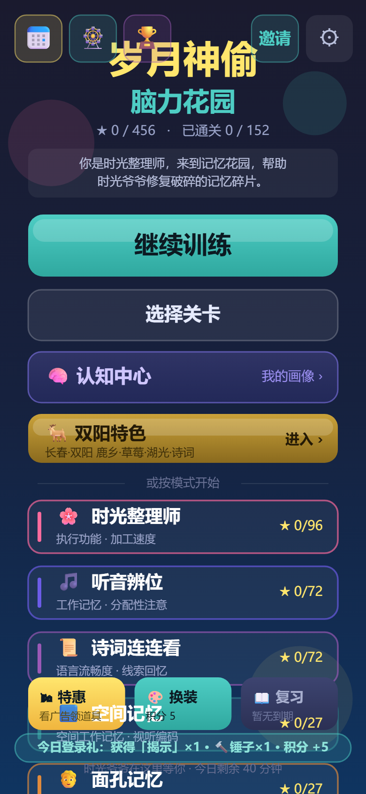

# 营销文案 A/B 测试方案（消消乐分享裂变）

> **实施状态（2026-10-07 已落地）**：游戏端与 Strapi 两侧的改造代码均已写入，类型检查通过。

## 改动文件清单

**Strapi（`strapi/plugins/`）**
- `zhao-studio/server/src/content-types/ab-variant/schema.json`：新增 `shareTitle` / `shareDesc` / `shareImage` / `shareLink`。
- `zhao-studio/server/src/content-types/browser-log/schema.json`：新增 `abVariant` 关联（→ ab-variant）。
- `zhao-studio/server/src/services/ab-test.ts`：`pickVariant` 支持按 `promo-campaign.code` 解析活动（原仅支持 documentId），变体文档天然带出分享文案字段。
- `zhao-studio/server/src/services/analytics.ts`：`trackPageView` / `trackAdClick` 透传 `abVariant` 写入 `browser-log`。
- `zhao-studio/server/src/services/channel-report.ts`：实现 `groupBy:'variant'`，按变体聚合 曝光/点击/CTR/转化。
- `zhao-track/server/src/services/click-orchestrator.ts`：放开 `couponId` 必填（可选），新增 `abVariantId`（传入则直接归因），无 coupon 时跳过链接置换。
- `zhao-track/server/src/controllers/click.ts`：透传 `abVariantId`，缺失 couponId 时传 `undefined`。

> 注：schema 字段为新增，本地 `strapi develop/start` 会自动建列；生产环境如需可补迁移。

**游戏端（`xiaoxiaole/`）**
- `src/core/Env.ts`：新增 `marketingApiBase` / `marketingCampaignCode` 配置（运行时 `window.__APP_ENV__` 注入）。
- `src/core/MarketingShare.ts`（新增）：拉取 A/B 文案 → 注入微信卡片 → 链接打标(`camp/v/st`) → 上报「曝光」(page-view) 与「打开」(click)。
- `src/Main.ts`：`bootstrap()` 早期 `void initMarketingShare()`。
- `src/scenes/ResultScene.ts`：分享链接改用 `getMarketingShareLink()`（带追踪参数）。

> 目标：按「发布渠道 / 发布位置 / 发布方式 / 发布文案」统计分享卡的点击率（CTR）与转化（ROI）。
> 结论先行：**Strapi 侧 80% 能力已存在**，本次主要是「补字段 + 放开约束 + 实现 stub」，游戏端为新增接入。

---

## 一、现状盘点（已存在，无需新建）

`strapi/plugins/zhao-studio` + `zhao-track` 已具备完整归因底座：

| 能力 | 实体 / 接口 | 说明 |
| --- | --- | --- |
| 推广渠道（=渠道/方式） | `promo-channel`（含 `scene` 枚举：wechat_group / short_video / live_stream / poster / article / other） | 代表投放渠道与「方式/场景」 |
| 营销活动 | `promo-campaign`（绑定 channel + 时间范围） | 一次有起止时间的活动 |
| A/B 实验 | `ab-experiment`（running 态，含 variants） | 按权重分流 |
| A/B 变体 | `ab-variant`（`weight`、`article`、`coupon`） | **目前仅绑文章/优惠券，缺「分享文案创意」** |
| 变体选择 | `GET /api/zhao-studio/v1/variants/pick?campaignId=`（`auth:false`） | 公开，按权重返回变体 |
| 来源标签 | `zhao-track.source-tag`（`tagId`/`promoCampaign`/`utm*`/`deviceFingerprint`） | 落地归因入口 |
| 点击事件 | `zhao-track.click-event`（`abVariant`/`promoCampaign`/`sourceTag`/`clickedAt`…） | A/B 报表与渠道报表的归因源 |
| 曝光埋点 | `POST /api/zhao-studio/v1/analytics/page-view`（`auth:false`，写 `browser-log`，可由 `sessionId→source-tag` 反查 `promoChannelCode`） | 已有 |
| 渠道报表 | `channel-report.getChannelReport`（funnel：impressions/adClicks/couponClicks/orders/ROI） | `groupBy:'variant'` 当前为 stub |

归因闭环：`source/identify` 建来源标签 → 点击时 `click-orchestrator` 自动按 campaign 调 `ab-test.pickVariant` 落 `abVariant` 到 `click-event` → A/B 报表按 `abVariant` 聚合。

---

## 二、Strapi 需改动（精确清单）

### 1. `ab-variant` 增加「分享文案创意」字段（核心）
`strapi/plugins/zhao-studio/server/src/content-types/ab-variant/schema.json` 增加：
- `shareTitle`（string）、`shareDesc`（text）、`shareImage`（string/url）、`shareLink`（string/url，可选落地页）。
- 同时 `ab-test.pickVariant` 返回结果需包含上述字段（service `pickVariant` 构造返回对象时带上）。

> 这样游戏端 `variants/pick` 才能拿到标题/描述/图片，用于渲染微信转发卡片。

### 2. 放开 `click-orchestrator` 的 `couponId` 必填（核心）
`strapi/plugins/zhao-track/server/src/services/click-orchestrator.ts`：
- `couponId` 改为**可选**；无 coupon 时跳过优惠券校验 / 链接置换，仍写入 `click-event`。
- 新增可选参数 `abVariantId`：若传入则直接用于 `click-event.abVariant`，**不再自动 pick**（保证点击归因到「分享者当时展示的文案」）。无 coupon 且未传 `abVariantId` 时，保留现有「按 campaign 自动 pick」逻辑兜底。
- 来源校验（sourceTagId / utm）保持不变。

### 3. 曝光事件带 `abVariant`
`strapi/plugins/zhao-studio/server/src/content-types/browser-log/schema.json` 增加 `abVariant`（`relation` → `plugin::zhao-studio.ab-variant`，可空）；`analytics.trackPageView` / `trackAdClick` 透传 `data.abVariant`（已有 `sessionId→source-tag→channel` 反查，无需再算 `promoChannelCode`）。

### 4. 实现 `channel-report` 的 `groupBy:'variant'`
`strapi/plugins/zhao-studio/server/src/services/channel-report.ts`：`getChannelReport` 当前签名接受 `groupBy?: 'day'|'campaign'|'variant'` 但未真正按 variant 分组。补充：当 `groupBy==='variant'` 时，按 `click-event.abVariant` + `browser-log.abVariant`（曝光）聚合，输出每个文案变体的 `impressions / clicks / ctr / orders / roi`，供运营对比「哪条文案更好」。

### 5. 数据录入（非代码，在 TAdmin 操作）
为消消乐建一套配置：
1. `promo-channel`：如「微信裂变」，`scene=wechat_group`（即「发布方式」）。
2. `promo-campaign`：绑定上述 channel，`code=xxl-share-2026`（游戏端 `MARKETING_CAMPAIGN_CODE` 填此值），设好起止时间。
3. `ab-experiment`：`status=running`，`channel`/`campaign` 指向上述，加 N 个 `ab-variant`，每个 variant 填一套 `shareTitle/shareDesc/shareImage`。
> 「发布位置（广告位）」维度：promo 模型未单独建模；消消乐分享场景位置意义弱，可先用 `promo-channel.scene` 表示方式，或后续在 `ab-variant` 加 `position` 枚举（朋友圈/信息流/开屏）。建议本期不做。

### 6. 游戏端环境变量（部署注入 `window.__APP_ENV__`）
- `MARKETING_API_BASE`：Strapi 公共宿主，即 **`https://h.joho.cn`**（路由前缀 `/api/zhao-studio`、`/api/zhao-track`；与 SSO 同一后端，非 `api.yourbao.cn`）。
- `MARKETING_CAMPAIGN_CODE`：对应 `promo-campaign.code`。为空则游戏端自动跳过 A/B，保持原样。

---

## 三、游戏端接入（已写代码：`xiaoxiaole/src/core/MarketingShare.ts`）

调用契约（base = `MARKETING_API_BASE`）：
- `GET  {base}/api/zhao-studio/v1/variants/pick?campaignId=<code>` —— 拉取生效文案变体（含 shareTitle/shareDesc/shareImage）。
- `POST {base}/api/zhao-track/v1/zhao-track/source/identify` —— 落地建/更新来源标签（带 `utm.utmSource=code`、`utm.utmContent=variantId`、`deviceFingerprint`）。
- `POST {base}/api/zhao-studio/v1/analytics/page-view` —— 曝光（body `{data:{sessionId, abVariant, userAgent, language, screen}}`）。
- `POST {base}/api/zhao-track/v1/zhao-track/click` —— 打开（body `{sourceTagId, deviceFingerprint, abVariantId}`）。

游戏端行为：
1. `Main.bootstrap()` 早期 `void initMarketingShare()`。
2. 未在 URL/环境变量拿到 `campaignCode` → 直接跳过，游戏保持原样。
3. 拉取变体 → 注入微信转发卡片（`window.__setWechatShare`，见 `bin/wechat-share.js`）。
4. 分享链接打标：`?camp=<code>&v=<variantId>&st=<sourceTagId>`。
5. 曝光上报（每次加载）；若命中分享链接（`st`/`v`）额外上报一次「打开」，归因到原展示文案。
6. `ResultScene.onShare` 的 `navigator.share` 链接改用 `getMarketingShareLink()`，保证非微信分享也带追踪。

容错：所有上报走 `httpPost` 吞掉异常；在 Strapi 改造（#1/#2/#3）上线前，游戏端自动降级（用默认文案、上报静默失败），不破坏现有体验。

---

## 四、A/B 效果怎么看
- 文案维度 CTR = `click-event(abVariant)` 打开数 / `browser-log(abVariant)` 曝光数，由 `channel-report` `groupBy:'variant'` 输出。
- 渠道/方式维度：沿用现有 `channel-report`（按 `promoChannelCode`）。
- 转化/ROI：已有 `order` + `couponClicks` 口径；消消乐若无下单，可用「打开→注册/留存」作为下游转化新增指标（后续扩展）。

---

## 五、上线验证记录（2026-10-07）

**结论：全链路已上线并通过端到端验证**（Strapi h.joho.cn + 游戏端 game.yourbao.cn）。

### 上线内容与执行差异
1. **P0**：Strapi 以「本地构建 dist bundle + scp + pm2 restart」部署（服务器不构建），schema 自动迁移确认完成（`zhao_ab_variants` 4 个 share_* 列、`zhao_browser_logs_ab_variant_lnk` 等关联表均生效）；游戏端 `bin/index.html` 注入 `window.__APP_ENV__`（MARKETING_API_BASE / MARKETING_CAMPAIGN_CODE），bundle 部署至 odoo 服务器 `/opt/1panel/apps/openresty/openresty/www/sites/game.joho.cn/tour/xxl/`。
2. **P1**：后台 4 条记录经 Content-Manager API 直连录入失败（body 中 `status` 字段与 D&P 发布状态撞名报 "Invalid status"），改**幂等 SQL 直插**并发布。生效 documentId：渠道 `tbox3x8ms9edt7f58y5mc0m1`、活动 `6e9c1af36bf5335241f1bbb1`、实验(running) `87269abd787e0d80292c4528`、温情版 `10473a584fe79f3262dd09c6`、挑战版 `2d981bf30d828312072d5f0d`；分享图 PIL 生成 300×300 上传至 `/uploads/xxl-a.png`、`xxl-b.png`。
3. **P2 联调中修复的 bug**：
   - **Strapi v5 关联语义**（5 个文件）：`findMany` 过滤关联必须 `{ campaign: { documentId } }` 包裹（直接传 documentId 会被当整型主键报 500）；`documents.create` 关联字段只接受数值 id（`analytics.ts` 加 `resolveVariantId` helper，`source-resolver.ts`/`click-orchestrator.ts` 同类修复）。
   - **游戏端 `initMarketingShare` 只 import 未调用**（`Main.ts`）：导致营销请求从未发出。已修复：`bootstrap()` 消费 URL 参数后、SSO 跳转检查前 `void initMarketingShare()`。
   - **SSO return_url 丢归因参数**（`SsoAuth.ts`）：`redirectToSsoLogin` 的 returnUrl 只取 `origin+pathname`，未登录打开者经 SSO 登录回跳后 `camp/v/st` 全丢。已修复：fallback 追加 `location.search`。
   - **identify 跨设备共享 tag**（`source-resolver.ts`）：utm 组合匹配对所有打开者相同，跨设备共享会让 click 归因失真。已修复：utm 组合匹配限同设备；新建 tag 的 `tagId` 直接用 `deviceFingerprint`（click 的 `sourceTagId` 即可命中设备自有 tag，campaign 归因闭环）。

### 端到端验证（手机视口 390×844 dpr=2）
- 链接：`https://game.yourbao.cn/tour/xxl/?camp=xxl-share-2026&v=<温情版id>&st=<tag>`，Playwright 预注入登录态（`bg_auth_v1`，绕过 SSO 门禁）。
- 网络观测：`pick`（命中温情版且与链接 `v` 一致）→ `source/identify` → `page-view` → `click` 四个请求全部 200。
- DB 闭环：browser-log 曝光带变体（温情版）；click-event 带变体 + 设备自有 source_tag（utm_source=xxl-share-2026、utm_content=变体）+ promoCampaign=xxl-share-2026。
- 游戏主菜单截图（营销请求全通、无相关报错）：

### 遗留
- `channel-report?groupBy=variant` 走 zhao-auth 鉴权（非 strapi admin token），需在 TAdmin/运营后台验证报表输出。
- P3 观察期（3~7 天 CTR 对比）由运营执行；回滚方式见交接文档。
