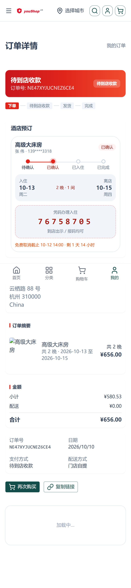
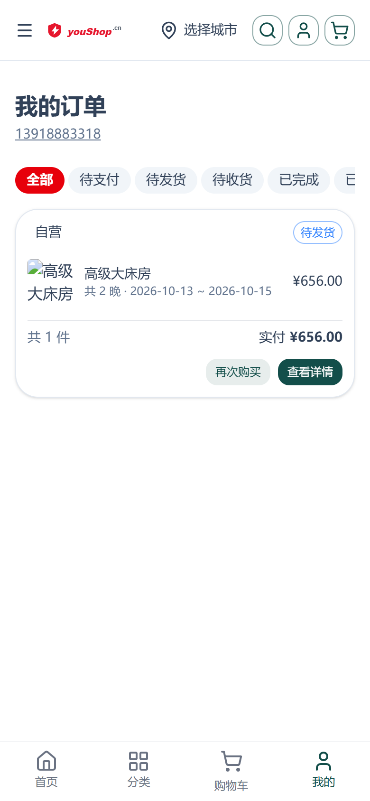

# 酒店预订闭环操作手册

> 适用站点：C 端商城（nshop）+ 商家后台（web-admin）｜服务端：Vendure cjk-plugin 酒店预订域（P1 房态锁房 / P2 房价方案 / P3 预订状态机 / P4 改期取消）
> 覆盖内容：房量配置、房价方案、预订生命周期（状态步骤条/入住码/政策倒计时）、核销与取消、手机视口截图、测试用例清单。
> 状态：随阶段交付增量更新（当前覆盖至 P3 Task 12）。

---

## 目录

- [1. 功能总览](#1-功能总览)
- [2. 商家配置：房量日历与房价方案](#2-商家配置房量日历与房价方案)
- [3. C 端预订流程与订单预订卡](#3-c-端预订流程与订单预订卡)
- [4. 预订状态机说明](#4-预订状态机说明)
- [5. 手机视口截图](#5-手机视口截图)
- [6. 测试用例清单](#6-测试用例清单)
- [7. 常见问题](#7-常见问题)

---

## 1. 功能总览

在既有「酒店逐晚计价」之上提供四段闭环能力：

| 阶段 | 能力 | 关键机制 |
|------|------|----------|
| P1 房态库存与锁房 | 按房型逐日房量、加购锁房、防超订 | hold（15 分钟 TTL）/ booked / released 三态锁房单；满房返回 `HOTEL_SOLD_OUT` |
| P2 多房价方案 | 折扣/固定/加价 × 会员/协议专属方案 | OrderLine 携带 `ratePlanCode` 实时套价 |
| P3 预订下单闭环 | 预订单状态机 + 入住码核销 | 支付事件自动确认（生成 8 位入住码 + 固化免费取消截止点） |
| P4 改期取消 | C 端自助取消退款/在线改期 | 按取消政策计算退款，走售后单退款通道 |

酒店行识别口径：订单行 customFields 携带 `hotelCheckIn / hotelCheckOut / hotelNights`（`YYYY-MM-DD` 字符串）即为酒店预订行，自动创建预订单（HotelBooking）。

---

## 2. 商家配置：房量日历与房价方案

（本节随 Task 4/9 交付补充完整截图与操作步骤）

### 2.1 房量日历（web-admin · 商品编辑 → 变体矩阵）

- 月视图网格：每格展示 **日 / 房量 / 剩 N / 满房 / 关房**。
- 单日编辑：点击格子直接改房量或开关「关房」。
- 批量设置：选日期范围 + 房量 + 关房开关，一键套用。
- 数据口径：无 `HotelRoomDay` 行时回退变体 `hotelRoomConfig.totalRooms`；两者皆无视为**不限房**；「关房」该日剩余 = 0。

### 2.2 房价方案（web-admin · 商品编辑 → 房价方案卡）

- 列表卡展示：名称 / 类型（折扣/固定/加价）/ 调整值 / 会员专属 / 启停。
- A 行内快捷改 + B 弹层编辑融合：行内可改启停，新建/编辑走弹层表单。
- 方案维度字段：`adjustType`（discount 千分比 / fixed / surcharge）、`memberOnly`、售卖期、`cancelPolicyOverride`（覆盖房型级取消政策）。

---

## 3. C 端预订流程与订单预订卡

### 3.1 下单与自动确认

1. C 端商品详情页选日期区间（DateBar 显示「余 N 间 / 紧张 / 满房」，满房日期禁选）→ 可选房价方案 chips → 加购。
2. 加购即锁房（hold，15 分钟）；下单进入待支付后预订单创建（`pendingDeposit`）。
3. **支付自动确认**：未启用支付计划的房型 = 订单全额付清（PaymentSettled）→ 预订单转 `confirmed`，生成 **8 位入住码**、固化**免费取消截止点**、锁房单 hold → booked。
4. 客户在「我的订单」订单详情页查看预订卡。

### 3.2 订单详情预订卡

订单详情页中酒店行渲染为**预订卡**（行程步骤条式），内容：

- **状态徽标 + 4 步步骤条**：预订提交 → 支付确认 → 入住核销 → 离店完成；终态（completed/cancelled）隐藏步骤条。
- **日期区间块**：入住日 → 离店日、N 晚、间数。
- **三态提示区**：
  - `pendingDeposit`：待付金额提示；
  - `confirmed`：**入住码**（虚线高亮区）+ 免费取消截止倒计时；
  - `cancelled`：红字已取消说明。
- **联系酒店**：订单 customFields 配置了 `hotelPhone` 时展示。

---

## 4. 预订状态机说明

| 状态 | 含义 | 流入 | 流出 |
|------|------|------|------|
| `pendingDeposit` | 待支付（预订单已建） | 下单（含酒店行） | 支付事件 → confirmed |
| `confirmed` | 已确认（有入住码） | 订金/全额付清自动确认 | 核销 → checkedIn；取消 → cancelled |
| `checkedIn` | 已入住 | admin 核销入住码（当日 ∈ [checkIn, checkOut)） | 离店 → completed |
| `completed` | 已完成 | 离店日定时任务 / 核销离店 | 终态 |
| `cancelled` | 已取消 | C 端自助取消（P4）/ admin 强制取消 | 终态（释放锁房） |
| `noShow` | 未入住（过离店日未核销） | 定时任务 | 终态（V1 不自动扣款） |

入住人兜底链：订单行 `hotelGuestName` → 订单客户姓名 → 收货地址 fullName。

---

## 5. 手机视口截图

标准视口：390×844，dpr=2（780×1688 实际像素）。

### 5.1 已确认态预订卡（订单详情页）

订单详情页内嵌「酒店预订」卡：状态徽标「已确认」、行程步骤条（核验已 → 已确认 → 已入住 → 已完成，当前停「已确认」）、入住/退房日期块（10-13 ~ 10-15 · 2 晚 · 1 间）、入住码 76758705（凭码办理入住，到店出示/截图可用）、免费取消截止倒计时（10-12 14:00，剩 1 天 14 小时）、联系酒店（地址）：

### 5.2 订单列表页

订单 tabs（全部/待支付/待发货/待收货/已完成/已取消）+ 酒店订单条目（入住日期区间与晚数、实付金额、再次购买/查看详情）：

---

## 6. 测试用例清单

（P3 e2e：`cjk-plugins-e2e/e2e/hotel-booking-flow.e2e-spec.ts`，5 用例全绿）

| # | 用例 | 预期 |
|---|------|------|
| 1 | 下单（含酒店行）→ 预订金付清 | booking 自动 `confirmed`，入住码 8 位、cancelDeadlineAt 固化、锁房 hold→booked |
| 2 | 核销入住码 → 完成 | `checkedIn` → `completed` |
| 3 | 满房日期加购 | 拦截 `HOTEL_SOLD_OUT|<日期>该日期已满房` |
| 4 | 强制取消 | 释放锁房后该晚可再订 |
| 5 | 未支付订单入住 | 状态机拦截核销 |

---

## 7. 常见问题

- **下单报「该日期已满房」但后台看有余量**：多为 15 分钟内废弃订单的孤儿 hold 占用，等 TTL 过期自动释放（或管理端触发表清理）后重试。
- **订单进不了「待支付」状态**：检查该变体是否已分配**配送档案**（按档案分箱归置 shippingLine，无档案时运费行为空导致无法流转）。
- **预订卡不显示入住码**：预订状态未到 `confirmed`（支付计划场景需订金期次付清，普通场景需订单全额付清）。
- **「联系酒店」不展示**：订单 customFields 未配置 `hotelPhone`。
