# 商品详情页六项修复 · 操作与验收手册

> 适用站点：C 端商城 www.youshop.cn（nshop）｜运营后台 e.joho.cn/guanli（web-admin）
> 本次修复覆盖：商品图片多图展示、促销/服务方案后台配置、就近库存城市兜底、营销标签角标、面包屑层级、底部导航栏。

---

## 目录

- [1. 六项修复一览](#1-六项修复一览)
- [2. 运营端操作：促销方案 / 服务保障配置](#2-运营端操作促销方案--服务保障配置)
- [3. 运营端操作：营销标签与商品图片](#3-运营端操作营销标签与商品图片)
- [4. C 端验收点（手机视口）](#4-c-端验收点手机视口)
- [5. 常见问题](#5-常见问题)
- [6. 酒店房型订单行（2026-09-30）](#6-酒店房型订单行2026-09-30)
- [7. 商品类型标记（2026-10-10）](#7-商品类型标记2026-10-10)
- [8. 酒店房量日历（2026-10-10）](#8-酒店房量日历2026-10-10)
- [9. 酒店房态余量展示（2026-10-10）](#9-酒店房态余量展示2026-10-10)
- [10. 房价方案选择（2026-10-10）](#10-房价方案选择2026-10-10)

---

## 1. 六项修复一览

| # | 修复项 | 修复前 | 修复后 |
|---|--------|--------|--------|
| 1 | 商品图片 | 多图被裁切、无法滑动 | 缩略图条可横滑完整查看；大图显示 `n/m` 角标 |
| 2 | 促销/服务方案 | 前端写死文案 | 运营后台维护「方案库」，商品可多选覆盖，C 端按「商品→频道→i18n」回退 |
| 3 | 就近库存 | 无定位时不显示门店库存 | 无定位但有城市时按城市兜底查询；无城市才显示定位引导 |
| 4 | 营销标签 | 仅列表页有标签 | 详情页主图右上角以角标叠层显示；灯箱 caption 同步；12 语言包映射 |
| 5 | 面包屑 | 同级分类出现伪层级（休闲娱乐 > 特色） | 只取首个顶级分类：`首页 > 休闲娱乐 > 商品名` |
| 6 | 底部导航栏 | 四列导航挤压双按钮、文字换行变形 | 仅保留「返回 + 首页(宽屏) + 加入购物车 + 立即购买」，宽窄屏自适应 |

---

## 2. 运营端操作：促销方案 / 服务保障配置

### 2.1 第一步：维护频道方案库（店铺信息）

1. 登录运营后台 `e.joho.cn/guanli`，进入 **店铺信息**
2. 找到 **「促销方案库」** 卡片：每行填写 `code`、中文文案、英文文案
3. 点击 **「+ 添加方案」** 增加条目，不需要的条目点 **「删」** 移除
4. **「服务保障库」** 卡片同理
5. 点击 **「保存」**

> 方案库是**频道默认**：只要商品未单独勾选，C 端展示方案库全部文案。

```
┌────────────────────────────────────────────┐
│ 促销方案库（频道默认；商品可覆盖）           │
│ ┌──────────┬────────────┬────────────┐ ┐   │
│ │ freeShip99│ 满99元包邮  │Free ship 99│ │删 │
│ └──────────┴────────────┴────────────┘ ┘   │
│ [+ 添加方案]                                │
│ 服务保障库（频道默认；商品可覆盖）           │
│ ┌──────────┬────────────┬────────────┐ ┐   │
│ │ refund7   │7天无理由退换│7-day return│ │删 │
│ └──────────┴────────────┴────────────┘ ┘   │
│ [+ 添加方案]                                │
│                                [保存]      │
└────────────────────────────────────────────┘
```

### 2.2 第二步：商品选择促销/服务（商品编辑 → 品牌营销）

1. 进入 **商品管理 → 编辑商品**
2. 切换到 **「品牌营销」** Tab
3. **「促销方案」** 卡片：勾选该商品要展示的方案（来自方案库）
4. **「服务保障」** 卡片：勾选该商品要展示的保障
5. 保存商品

> 商品勾选后为**商品覆盖**：C 端只显示勾选项；若方案库为空，页面提示先去店铺信息配置。

```
┌────────────────────────────────────────────┐
│ 促销方案                                    │
│ ☑ 满99元包邮   ☐ 下单立减20   ☐ 买一送一     │
│ 服务保障                                    │
│ ☑ 7天无理由退换  ☑ 顺丰包邮   ☐ 极速退款     │
└────────────────────────────────────────────┘
```

### 2.3 C 端展示回退链

```
商品勾选（promos/services） → 频道方案库（promoSchemes/serviceSchemes） → i18n 默认文案
```

### 2.4 运营端截图

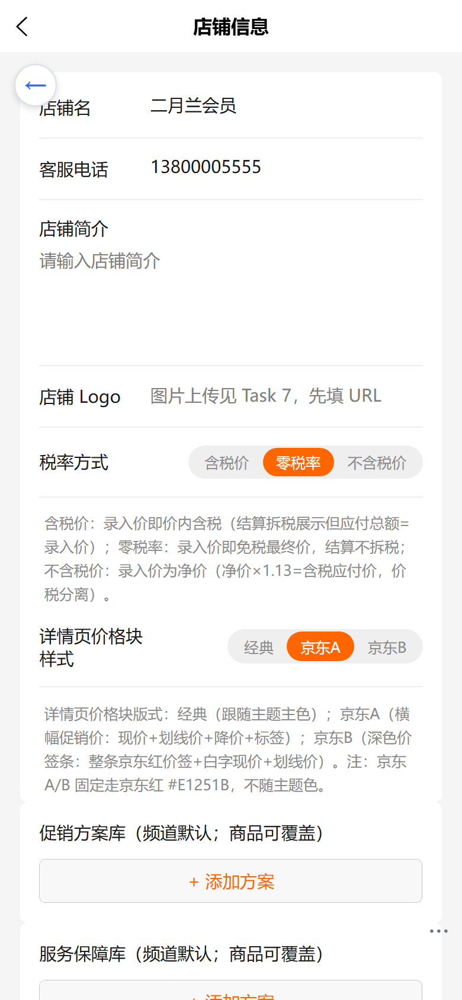

- 「促销方案库 / 服务保障库」卡片：每行填写 code + 中文 + 英文，`+ 添加方案` 增行，`删` 移除
- 未配置时商品侧显示「请先在店铺信息-促销方案库配置」空态引导

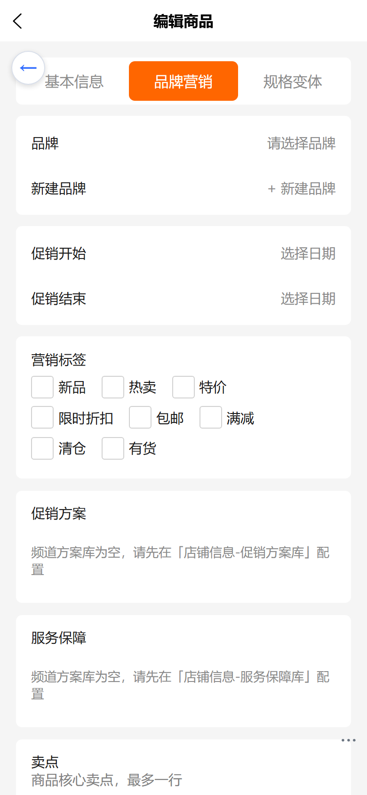

- 「促销方案 / 服务保障」多选：选项来自频道方案库，勾选即商品覆盖；不勾选则回退频道默认
- 「营销标签」：新品/热卖/特价/限时折扣/包邮/满减/清仓/有货 8 个可选

---

## 3. 运营端操作：营销标签与商品图片

### 3.1 营销标签

1. 商品编辑 → **「品牌营销」** Tab → **「营销标签」**
2. 勾选标签（新品/热卖/特价/限时折扣/包邮/满减/清仓/有货）
3. 保存后 C 端详情页主图右上角以**红色角标叠层**显示；点开大图（灯箱）caption 同步标签

> 12 种语言均已内置标签翻译，未知 code 会按原文兜底显示，不会报错。

### 3.2 商品图片

- 图片区显示 **「已关联 N 张」**，最多 9 张
- C 端缩略图条**可横向滑动**，点击切换大图；大图左上角显示 `n/m` 当前位置

---

## 4. C 端验收点（手机视口）

> 以下截图均为手机视口（390×844、dpr=2）实拍。

### 4.1 商品图片与营销标签角标


- 缩略图条可横滑、大图 `n/m` 角标
- 主图右上角营销标签角标（如「降价」「新品」）

### 4.2 促销/服务与就近库存

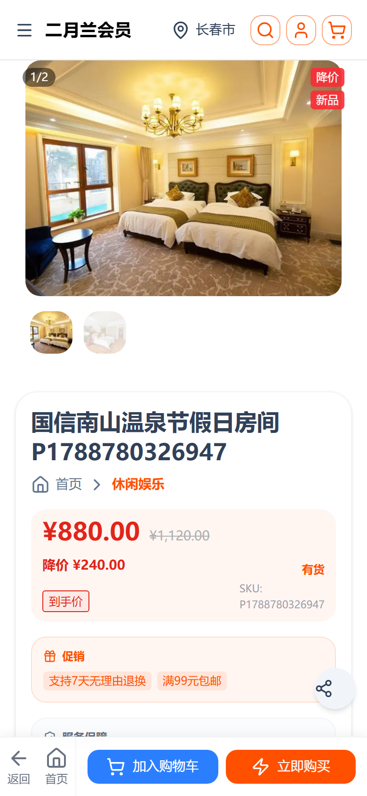

- 促销/服务条来自后台方案库配置
- **无定位、有城市**时按城市查询就近库存（不再出现「开启定位可查看就近库存」）

### 4.3 就近库存·城市切换库存三态

> 前提：主仓库（默认）绑定至「上海市」，另建「北京前置仓」并绑定同商品；两仓库服务城市分别配置为上海市 / 北京市。切换已选城市时，详情页主图下方「就近库存」数值随城市变化。

　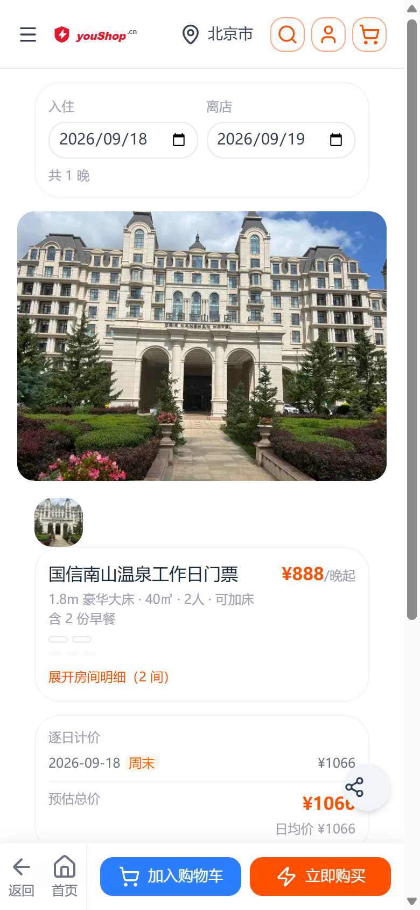

- **上海（服务城市）**：`就近库存 50 件可售 共 1 个门店`（命中本市默认仓）
- **北京（服务城市）**：`就近库存 10 件可售 共 1 个门店`（命中北京前置仓）
- **未覆盖城市**（如广州）：回退镜像虚拟仓可售数；**未选城市**：聚合全部绑定门店库存
- **纯虚拟商品**（未绑定任何门店仓）：任意城市均恒定同一可售数，不受城市切换影响（防回归）

### 4.4 面包屑

- 面包屑 = `首页 > 休闲娱乐 > 商品名`（只取首个顶级分类，无伪层级）

### 4.5 底部导航栏

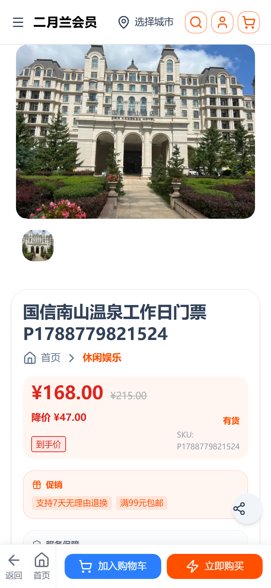　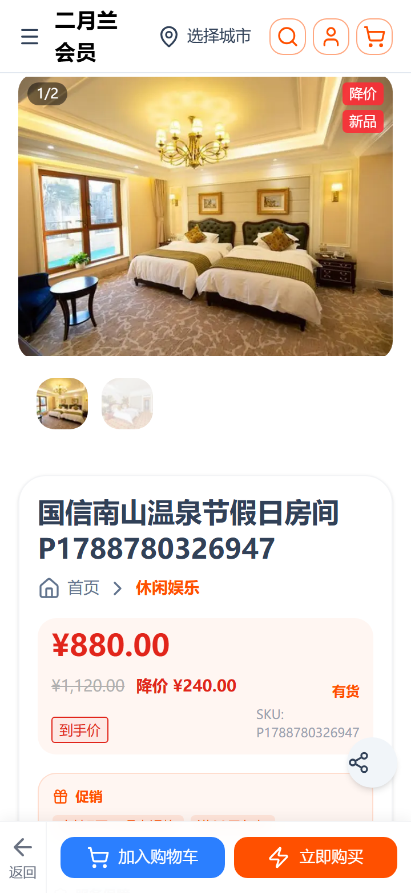

- 宽屏（≥375px）：返回 | 首页 | 加入购物车 | 立即购买
- 窄屏（<375px）：返回 | 加入购物车 | 立即购买（首页隐藏，双按钮不换行）

---

## 5. 常见问题

### Q1：C 端促销条没显示后台配的方案？

1. 确认「店铺信息」已保存方案库，且 **code 非空**
2. 确认商品「品牌营销」勾选的 code 与方案库 code 一致
3. 商品勾选了 code 就只显示勾选项——想恢复频道默认，取消全部勾选

### Q2：营销标签显示成了英文 code？

- 标签 code 不在 12 语言包翻译表内（按原文兜底）。请在语言包 `messages.detail.marketingTags` 补充该 code 的翻译，或用后台内置的 8 个标签 code

### Q3：就近库存提示「开启定位」？

- 说明当前**既无定位、也无已选城市**：在首页/定位组件手动选择城市后即按城市兜底查询

### Q4：底栏在窄屏变形？

- 窄屏（<375px）自动隐藏「首页」项，仅保留返回+双按钮；若仍变形，检查是否命中 `min-[375px]:flex` 断点

---

## 6. 酒店房型订单行（2026-09-30）

> 范围：酒店房型（变体 `customFields.hotelRoomConfig` 非空）的**详情页 → 购物车 → 结算页 → 订单页**全链路。
> 口径：**订单行数量 = 住宿晚数**，按入/离日期**逐晚计价**。
> 样例数据（生产 t2「二月兰会员」）：`国信南山温泉节假日房间`（variantId=58）。

### 6.1 计价口径

- 选择入住/离店日期后：**晚数 = 离店 − 入住**（入住当日计第 1 晚），并作为下单数量 `quantity`
- 单价 = 逐晚价格合计 ÷ 晚数；逐晚价格类型判定优先级：`custom > holiday > weekend > weekday`
- 例（e2e 默认口径）：入住 `2026-02-14`、离店 `2026-02-16`（2 晚）→ `quantity=2`、`unitPriceWithTax=94000`、`linePriceWithTax=188000`；逐晚 `2026-02-14=88000/weekend`、`2026-02-15=100000/holiday`
- 例（C 端可复现口径，即本文截图口径）：入住 `2026-10-07`、离店 `2026-10-09`（2 晚）→ `quantity=2`、`unitPriceWithTax=94000`、`linePriceWithTax=188000`；逐晚 `2026-10-07=100000/holiday`（国庆）、`2026-10-08=88000/weekday`。即「一晚 1000、一晚 880，合计 1880」

### 6.2 C 端验收点（手机视口 390×844 dpr=2）

> 截图口径：入住 `2026-10-07`、离店 `2026-10-09`（2 晚），即用户报的「节假日上浮、一晚 1000 一晚 880」场景。
> 录图脚本 `scripts/_shot-hotel-checkout.mjs`（默认指向生产 t2），脚本内对页面文本做断言，断言失败退出码非 0。

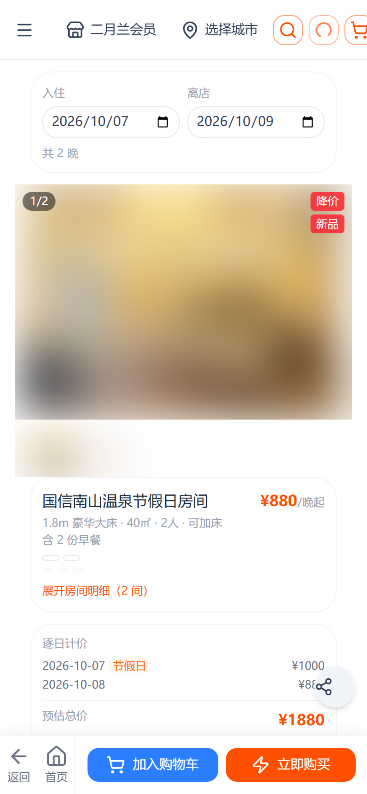

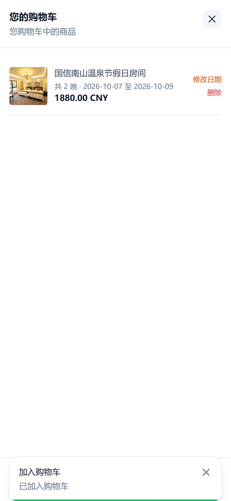

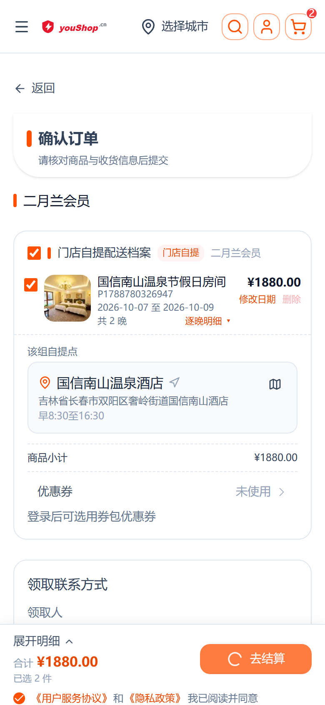

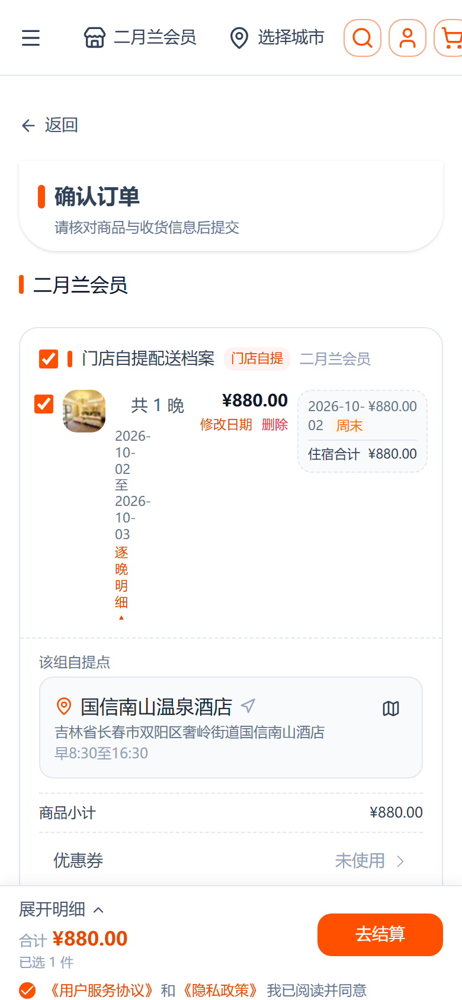

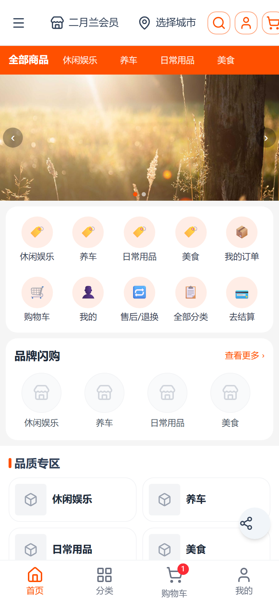

- 详情页：日期条可改期；「逐日计价」逐晚列出日期 + 日类型 + 价格，底部「预估总价 / 日均价」；加入购物车/立即购买受库存与晚数范围校验
- 购物车/结算/订单：酒店行统一显示「共 N 晚 · YYYY-MM-DD 至 YYYY-MM-DD」，**不显示单价、无数量步进器**（晚数由日期决定，不可步进）
- 结算页：金额只在行内显示合计（¥1880.00），点「逐晚明细」展开逐晚价格与「住宿合计」；明细块独占整行
- 页头：品牌位只渲染 logo 图（不再叠加租户名文本）；移动端（<640px）页头不渲染租户切换按钮，租户入口收敛到抽屉（`#body`），避免右侧组撑破 390px 视口、logo 被压成细缝（见 6.10）

### 6.3 后台配置：房源与逐晚价

商品变体自定义字段 `hotelRoomConfig`（文本，存 **JSON 字符串**；坏 JSON / 缺 `basePriceCent` 一律回退为非酒店）：

```json
{
  "basePriceCent": 88000,
  "minNights": 1,
  "maxNights": 30,
  "priceCalendar": [
    { "type": "holiday", "priceCent": 100000, "dates": ["2026-02-15", "2026-02-16"] },
    { "type": "holiday", "priceCent": 100000, "dates": ["2026-10-01", "2026-10-02", "2026-10-03", "2026-10-04", "2026-10-05", "2026-10-06", "2026-10-07"] }
  ]
}
```

- `priceCalendar[].type`：`weekday | weekend | holiday | custom`；`rate`（相对 `basePriceCent` 的系数）与 `priceCent`（固定价）二选一；`holiday/custom` 需带 `dates`
- 未命中任何段时回退 `basePriceCent`；`longStayDiscount`（连住折扣）可选
- **日期必须落在 C 端可选范围内才可能在页面上复现**：日期条限定「明天 ~ 今天+`advanceDays`」（本商品 `advanceDays=30`），过期 holiday 日期只在接口层可验证、页面上选不到。上例第二段（国庆 `2026-10-01~10-07`）就是为此追加的；如用于演示需按当前日期滚动更新。

### 6.4 自动化回归（对生产 e2e）

入离日期由环境变量 `CHECK_IN` / `CHECK_OUT` 指定（默认 `2026-02-14` / `2026-02-16`），**所有断言由日期推导**，换日期无需改脚本：

```
$env:SHOP_API='https://www.youshop.cn/shop-api'
$env:HOTEL_VARIANT_ID='58'
$env:CHANNEL_TOKEN='66ruvnhh34svhckaa2i'
$env:CHECK_IN='2026-10-07'; $env:CHECK_OUT='2026-10-09'   # 省略则用默认口径
node scripts/hotel-orderline-e2e.mjs
```

断言（8 条，`scripts/hotel-orderline-e2e.mjs` 运行输出原文，国庆口径）：

```
场景：2026-10-07 → 2026-10-09（2 晚）

逐晚明细：
  2026-10-07  holiday  ¥1000.00
  2026-10-08  weekday  ¥880.00
推导合计：¥1880.00（188000 分 / 2 晚，日均 ¥940.00）

PASS  数量=2（=晚数）
PASS  unitPriceWithTax=94000（=逐晚合计/晚数）
PASS  linePriceWithTax=188000（=逐晚价之和）
PASS  orderBoxes.isHotel=true
PASS  orderBoxes.hotelNights=2
PASS  逐晚条数=2
PASS  逐晚日期自 checkIn 起逐日连续
PASS  productSlug 非空（供修改日期跳回）
```

默认口径（`2026-02-14 → 2026-02-16`，不设 `CHECK_IN/CHECK_OUT`）同样 8/8 PASS（逐晚 `02-14 weekend ¥880` + `02-15 holiday ¥1000`），用于防止旧场景回归。

> 注意：Shop API 以 cookie 关联匿名活动订单，脚本内已用 cookieJar 维持同一会话，否则 `orderBoxes` 查不到刚加购的行。

### 6.4.1 录图脚本

```
node scripts/_shot-hotel-checkout.mjs     # 默认 BASE=https://www.youshop.cn/t2、国庆 2 晚场景
```

可用环境变量覆盖：`BASE`、`HOTEL_SLUG`、`CHECK_IN`、`CHECK_OUT`。脚本内含页面文本断言（详情页 ¥1880 / ¥1000 / ¥880，购物车「共 2 晚」/1880.00，结算页展开后「住宿合计」/1880.00），断言失败以非 0 退出码结束。

### 6.5 普通商品行：390px 折行布局 + 缩略图放大（2026-10-01）

**改前**：商品行 `<li>` 为 `flex`（默认 `nowrap`），「单价 / 步进器 / 行小计（`w-14`）/ 删除」四个 `shrink-0` 块与商品名同排。390px 下固定块 + 间距 + 内边距合计约 317px，中间描述列只剩约 49px，商品名被 `truncate` 到约 1 个字——**改动前既有问题**，非酒店行改动引入。

**改后（方案 A · 折行式）**：
- `<li>` 统一 `flex-wrap`；普通商品行的价格与操作包进 `basis-full` 第二行容器，左缩进与商品名左边缘对齐。
- 缩略图 36px → **56px**；取图宽度同步 `assetSrc(full, 48)` → `128`（56px @dpr2 的 2× 位图，避免放大发虚）。
- 第二行加 `flex-wrap` 兜底多语言：en-US `messages.account.delete` 为 "Delete"，比「删除」宽约 14px，单行放不下时换行而非溢出容器。

**同日精简（去重复声明 + 去魔数）**：

| 项 | 原 | 现 | 理由 |
| --- | --- | --- | --- |
| 缩略图尺寸 | `class="h-14 w-14"` | `class="h-[var(--line-thumb)] w-[var(--line-thumb)]"`，`--line-thumb: 3.5rem` | 尺寸成为单一来源，供缩进推导引用 |
| 第二行左缩进 | `pl-22`（写死 5.5rem = 88px） | `ps-[var(--line-indent)]`，`--line-indent: calc(1rem + 0.5rem + var(--line-thumb) + 0.5rem)` | 勾选框/间距/缩略图任一尺寸变化时自动跟随；同时由物理 `pl-` 改逻辑 `ps-`，RTL（fa-IR）下方向正确 |
| 第二行容器 | `flex w-full basis-full ...` | `flex basis-full ...`（删 `w-full`） | flex 主轴尺寸由 `flex-basis: 100%` 决定，`width: 100%` 被忽略，属重复声明 |

变量定义在 [BoxLines.vue](file:///d:/zhao/nshop/layers/base/app/components/checkout/BoxLines.vue#L224-L232) 的 `<style scoped>` 里，挂在行根 `.box-line` 上由子元素继承。

**版式选型**（按「设计变更先出内联 mockup 定稿」规范，先出 A/B/C 三版式内联预览后由用户选定）：

| 方案 | 换取方式 | 商品名可用宽 | 代价 |
|---|---|---|---|
| **A 折行式（选用）** | 行高换宽度 | 实测 244px（约 17 字） | 列表变长（多一行） |
| B 右列纵排 | 右列高度换宽度 | 估算 ≈212px | 行高最高 |
| C 极简单行 | 操作可见性换宽度 | 估算 ≈124px | 删除降为图标，仍仅约 8 字 |

**实机断言**（生产 t2，390×844 dpr=2，`scripts/_shot-hotel-checkout.mjs` 06 段）：

```
PASS  普通商品-缩略图 56×56：实际 56×56
PASS  普通商品-商品名可用宽 ≥200px：实际 244.0px（改造前约 49px，仅容 1 字）
PASS  普通商品-折行：商品名独占首行，价格与操作折到第二行（y 中心差 69.2px）
PASS  普通商品-操作行同带：单价与步进器并排于第二行（y 中心差 0.0px）
PASS  普通商品-缩进对齐：第二行左边缘与商品名左边缘一致（x 差 0.0px，阈值 ≤1）
PASS  普通商品-行小计：命中「¥336.00」（= 单价 ¥168.00 × 2）
PASS  06-checkout-normal-product.png 尺寸：780×1688（期望 780×1688）
```

> 精简后回归实测：缩略图 `x=53, 56×56`；商品名 `x=117, 宽 244`；单价 `x=117` → x 差 0.0px，证明 `--line-indent` 推导结果仍等于原写死的 88px。`缩进对齐` 这条断言是为替代「靠 `pl-22` 保证对齐」而新增的回归门（脚本 06 段）。

**接口层回归**：取 t2 渠道非酒店变体（`温泉门票` variantId=57）加购，断言 `isHotel === false`、`hotelNightly` 为空（`null` 或空数组，GraphQL 列表类型查询需带子字段）、`linePriceWithTax === unitPriceWithTax × quantity`，3 条全 PASS。

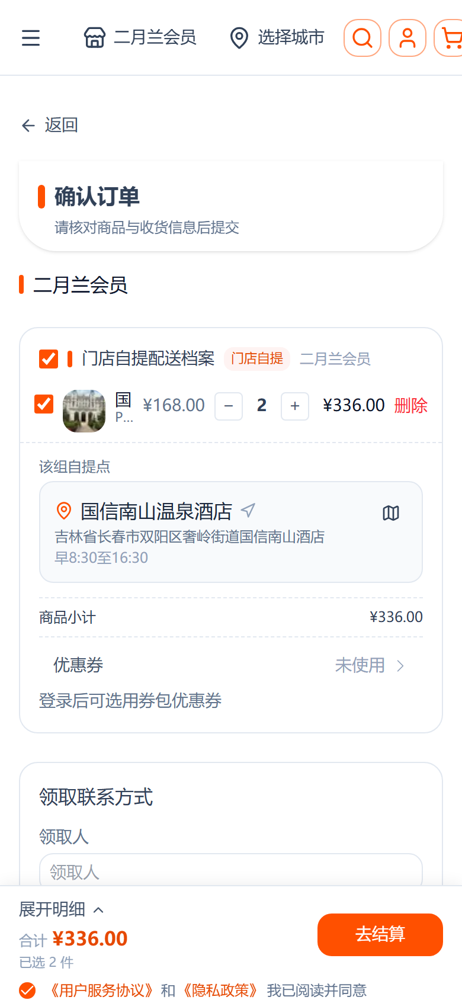

- 商品名实测可用宽 244px（视口 390px 减去纵向滚动条后为 375px），可完整显示「国信南山温泉工作日门票」11 字，不再截断。
- 酒店行未改结构（仍为「描述列 + 右列金额」），仅缩略图随组件一并放大到 56px，见 6.2 第 3、4 张图。

### 6.6 已知边界

- **i18n 词条（12 语言包已补全）**：`messages.hotel.*`（`nights / dateRange / nightlyDetail / changeDates / stayTotal / selectDatesFirst / nightsOutOfRange`）已在全部 12 个语言包（`zh-CN / en-US / fa-IR / bg-BG / ru-RU / ko-KR / it-IT / ja-JP / pt-BR / fr-FR / es-ES / de-DE`）定义，占位符 `{n}/{in}/{out}/{min}/{max}` 原样保留；`merge.ts` 仍以中文为基底兜底，新增语言时需同步补词条（见 6.10）。
- **商品行第二行宽度的多语言余量**：普通商品行第二行（单价 / 步进器 / 小计 / 删除）在 zh-CN 下几乎占满可用宽（实测右边缘余量约 2px）。更长语言（如 en-US "Delete"）靠该行 `flex-wrap` 换行兜底，不会溢出容器；若某语言的单价或小计位数显著更长，需重新核算该行宽度预算。

### 6.7 本次线上 500 缺陷记录

- **现象**：线上 `/t2/product/国信南山温泉节假日房间` 返回 **500**（「服务暂时不可用」），SSR 抛 `Cannot read properties of undefined (reading 'product')`；而普通商品页正常 200
- **根因**：`ProductVariant.availableStock` 的 GraphQL 类型为 `Int`（32 位有符号），而未跟踪库存（`trackInventory=FALSE`）的变体其 `getSaleableStockLevel()` 返回 `Number.MAX_SAFE_INTEGER`（9007199254740991），超出范围导致**整个 product 查询序列化失败**：

  ```
  [{"message":"Int cannot represent non 32-bit signed integer value: 9007199254740991",
    "path":["product","variants",0,"availableStock"]}]
  ```

  该字段由更早的「加购上限跟随真实库存」需求新增（未考虑未跟踪库存的极大值），酒店变体恰好未跟踪库存而触发。
- **修复**：`packages/core/src/api/resolvers/entity/product-variant-entity.resolver.ts` 在 resolver 边界钳制到 32 位上限 `Math.min(stock, 2147483647)`（保持返回 number；前端 `CartAddButton.vue` 仍按 999 上限自行钳制，加购上限不受影响）
- **验证**：Shop API 返回 `availableStock: 2147483647` 且无 GraphQL 错误；页面 HTTP **200**；酒店 e2e **7/7 PASS**

### 6.8 部署与回滚

- 后端（vendure，`d:\zhao\vendure`）：本地改 `src` → `packages/core` 执行 `npm run build` 重建 `dist`（dist 受控入库）→ commit + push → 服务器 `cd /www/apps/vendure && git pull --ff-only && pm2 restart vendure vendure-worker`
- 前端（nshop，`d:\zhao\nshop`）：本地 `npm run build` → `node scripts/deploy.mjs`（scp 产物 → 服务器解压 → `pm2 restart nshop`）
- **回滚**：`git revert <commit>` 后重跑上述部署即可；重新录图用 `scripts/_shot-hotel-checkout.mjs`（环境变量 `BASE`、`HOTEL_SLUG`、`CHECK_IN`、`CHECK_OUT`）

### 6.9 结算页酒店行 390px 布局修复（2026-10-01）

首次归档的截图为默认 1 晚且结算页展开态出现「日期文案逐字竖排换行」。复盘为两个独立问题，均已修复并重新部署：

- **口径问题（证据不实）**：原录图脚本未设置入离日期，取到详情页默认 1 晚，未能复现用户报的 2 晚/节假日场景。→ 脚本改为用查询串预填日期（`?checkIn=&checkOut=`）并加页面文本断言；服务端 `priceCalendar` 追加国庆段（见 6.3）使场景在 C 端可选范围内真实可复现。
- **布局缺陷（真实代码问题）**：`layers/base/app/components/checkout/BoxLines.vue` 的商品行 `<li>` 是 `flex`（默认 `nowrap`），展开的「逐晚明细」块虽写了 `w-full basis-full` 却**无法换行**，被压缩挤在同一行内，导致中间描述列宽度趋近于 0、日期文案逐字竖排；同时酒店行多了一个独立「共 N 晚」定宽列（`w-14`），进一步挤占描述列。→ 修法：商品行 `<li>` 追加 `flex-wrap`（当时只在酒店行加，普通商品行于 6.5 改为折行布局后同样依赖它）；去掉独立晚数列，把「共 2 晚」并入描述列与「逐晚明细」同排；日期行加 `truncate`、操作行加 `whitespace-nowrap` 兜底。
- 修复后：折叠态日期单行显示、展开态明细块独占整行横跨（见 6.2 第 3、4 张图）。
- 同一轮回归截图暴露普通商品行「商品名被挤到约 1 个字」，已按 6.5 出内联 mockup 定稿后修复（方案 A 折行式），`<li>` 的 `flex-wrap` 改为两分支共用。

### 6.10 页头品牌去重与移动端 390px 溢出修复（2026-10-01）

两处页头缺陷同轮修复（`d:\zhao\nshop\layers\base\app\components\`）：

**① 品牌位去重（`header/LogoElement.vue`）**
- 现象：t2 租户「二月兰会员」在页头渲染出**两个同名文本**，左侧 logo 位那个被压扁变形。
- 根因：`LogoElement.vue` 在无 logo 图时回退渲染租户名文本，与右侧租户切换器按钮的租户名重复。
- 修法（方案 A）：删除租户名文本分支，品牌位**恒渲染 logo 图**；无图时仅留占位，不再输出文本。

**② 移动端页头隐藏租户按钮（`AppHeader.vue`）**
- 现象（390px，结算页 t2）：文档 `scrollWidth=398 > 视口 390`（横向可滚、购物车角标被切），品牌 logo 被右侧组挤压成 **32px 细缝**。
- 根因：页头右侧组为 `租户按钮 + 城市按钮 + 搜索 + 账户 + 购物车`，其中租户名「二月兰会员」5 字使右侧组合计 **338px**（视口 390 − logo 组 32 − 间距）；租户名越长挤压越严重。
- 修法（方案 A）：`#right` 内的 `HeaderTenantSelector` 包一层 `hidden sm:flex`，**移动端（<640px）不渲染**；租户入口保留在移动端抽屉 `#body` 中的另一份（功能不丢失）。城市选择器保留——它决定配送/库存，是多城市店的主操作。
- 修后实测（生产 t2，390×844 dpr=2）：结算页/首页 `scrollWidth ≤ 390`（无横向溢出），logo 可用宽 ≥80px（不再是 32px 细缝）。

**③ i18n 12 语言包补全**
- 6.1 引入的 `messages.hotel.*` 此前仅 `zh-CN / en-US` 定义，其余 10 包缺失（违反「所有语言包必须同步补词条」规范）。
- 已补齐 `fa-IR / bg-BG / ru-RU / ko-KR / it-IT / ja-JP / pt-BR / fr-FR / es-ES / de-DE` 共 10 包 × 7 键，占位符原样保留，插入位置用语义邻居键（`tWeekend`/`tHoliday`/`tCustom`/`bedType`）定位。12 包均 `keys=7`。

**验收断言**（`scripts/_shot-hotel-checkout.mjs` 页头段，生产 t2）：

```
PASS  页头-结算页无横向溢出：scrollWidth=390 ≤ 视口 390（修复前 398）
PASS  页头-首页无横向溢出：scrollWidth=390 ≤ 视口 390
PASS  页头-logo 可用宽 ≥80px：实际 98px（修复前 32px，被压成细缝）
```

### 6.11 商品卡价格本地化 + 币种缺省修正（2026-10-01）

**现象**：首页「运营楼层 / 精选商品」与分类页的商品卡价格显示为 `168.00 CNY`（值 + 空格 + 币种），而详情页 / 购物车 / 结算页均为 `¥168.00`——同一站点两种写法，且前者不符合中文地区习惯。

**根因**（`layers/base/app/components/product/ProductCard.vue`）：
- 价格用模板字符串硬拼 `${值} ${币种}`，未走本地化货币格式化，**与当前站点语言无关**（浏览器默认语言为英文时更会渲染成 `CNY 168.00`）。
- 币种缺省值写成 `"EUR"`（`product.currencyCode ?? "EUR"`），本店结算币种为 CNY，缺字段时会显示欧元。

**修法**：
- 复用既有工具 `utils/format-money.ts` 的 `formatMoney(值, 币种, 当前 locale)`（与订单页 / 售后页同一口径），价格随站点语言正确格式化；
- 币种缺省由 `"EUR"` 改为 `"CNY"`；
- 同源问题一并修正：`pages/product/[slug].vue` 的 Schema.org `offers.priceCurrency` 缺省值同样由 `"EUR"` 改为 `"CNY"`（结构化数据币种错误会影响搜索引擎价格展示）。

**各语言实测输出**（`formatMoney(16800, "CNY", locale)`）：

| locale | 输出 | 说明 |
|---|---|---|
| `zh-CN` | `¥168.00` | 与详情页 / 购物车 / 结算页一致 |
| `en-US` | `CN¥168.00` | 币种明确，无歧义 |
| `ja-JP` | `元 168.00` | 按日语区习惯 |
| `de-DE` | `168,00 CN¥` | 千分位 / 小数点按德语区 |

**验收断言**（`scripts/_shot-hotel-checkout.mjs` 价格段，生产 t2）：

取样口径：分类页卡片根为 `ProductCard` 的 `<article>`，首页装修楼层为 `JdProductGrid` / `GoodsCardBlock` 的 NuxtLink 卡片（无 `<article>`），故按「卡片根 = `article` 或 `a[href*="/product/"]`」统一取样，并只取真实可见卡片（首页轮播存在不可见副本）。断言 = 卡片价格不含裸币种代码（`CNY` / `EUR` / `USD`）且至少一条带 `¥`。

```
  分类页商品卡价格: ["¥168.00","¥880.00","¥688.00","¥198.00"]
PASS  分类页-价格本地化：无裸币种代码且带 ¥ 符号（改前形如「168.00 CNY」）
  首页商品卡价格: ["¥168.00 ¥215.00","¥880.00 ¥1120.00","¥688.00 ¥880.00","¥198.00 ¥255.00","¥20.00 ¥35.00","¥0.00 ¥10.00"]
PASS  首页-价格本地化：无裸币种代码且带 ¥ 符号（改前形如「168.00 CNY」）
```

（首页每条为「现行价 + 划线原价」，均为 `¥` 前缀；改前该处渲染为 `168.00 CNY`。）

截图：`docs/manual/shots/2026-09-30-hotel-orderline/07-category-price.png`（分类页）、`08-home-price.png`（首页），手机视口 390×844 dpr=2 = 780×1688。

### 6.12 首页「为你推荐」楼层空态修复（2026-10-01）

**现象**：t2 首页「热门商品」楼层正常展示 9 件商品，紧随其后的「为你推荐」楼层却渲染「当前城市/配送方式下暂无可用商品」（生产 SSR HTML / hydrated DOM 各命中 1 处）。

**定位过程**（两次误判，记录以免重犯）：
1. 首次归因于装修积木的同页去重（`useCuratedGoods.ts` 的 `products` computed 排除「热门商品」已展示 productId）——**不是本现象的原因**。经 Admin API 查证：t2 渠道 `customFields.shopContent = null`，首页并未走装修积木，而是走「京东兜底楼层」。
2. 真正根因在 [index.vue](file:///d:/zhao/nshop/app/pages/index.vue#L139-L145) 的兜底取数：一次 `SearchProducts(take: 20)` 结果被切成 `hot = enriched.slice(0, 10)`、`more = enriched.slice(10, 20)`。t2 全站仅 9 件商品（`search.totalItems = 9`）→ **第二段恒为空** → 自动补位的 `recommend` 槽位（[HomeBlockRenderer.vue](file:///d:/zhao/nshop/layers/base/app/components/home/HomeBlockRenderer.vue#L60-L65) 以 `autoGoods.more` 直渲 `GoodsCardBlock`）渲染成空态。

**修法**（方案 A：回退为同一列表，宁可两楼层重复，也不显示误导空态）：

| 文件 | 改动 |
| --- | --- |
| `app/pages/index.vue` L139-145 | `more` 为空时回退为 `hot`：`return { hot, more: more.length ? more : hot }`（总商品 ≤10 件的店铺，两个楼层展示同一批商品） |
| `layers/base/app/composables/useCuratedGoods.ts` L200-214 | 同类缺陷的装修积木路径一并加固：去重排除后为空则回退未去重列表（`rest.length ? rest : items`），仅在「原本会为空」时生效，非空场景行为不变 |

**验收断言**（`scripts/_shot-hotel-checkout.mjs` 首页段，生产 t2）：

```
PASS  首页-无「暂无可用商品」空态：可见命中 0 处（改前 1 处）
```

> 断言按**可见元素**计数：PC 版式（≥1024px）在 390px 下为 `display:none`，其楼层同样存在，按全 DOM 计数会误判。

截图：`docs/manual/shots/2026-09-30-hotel-orderline/09-home-recommend.png`——「为你推荐」楼层内为商品卡（`¥168.00` / `¥880.00` 等），不再出现空态文案。

**已知取舍**：总商品数 ≤10 件时，两个楼层内容重复。运营如需区分，应在后台 `shopContent` 配置「热门商品 / 推荐商品」积木（各自指定集合或商品 slug），而非依赖兜底楼层的机械切片。

### 6.13 全语言包 i18n 审计与漏译修复（2026-10-01）

**背景**：nshop 支持 12 个语言包（`zh-CN` 为基底 + `en-US / bg-BG / ru-RU / fa-IR / de-DE / es-ES / fr-FR / it-IT / pt-BR / ja-JP / ko-KR`）。此前怀疑「各语言包相对 zh-CN 存在大量缺口、依赖中文兜底」，本机补一轮量化审计。

**审计口径（关键，首版踩坑已修正）**：语言包结构为

```ts
export default defineI18nLocale(() => zhFallbackLocale({ ...覆盖1... }, { ...覆盖2... }));
```

`merge.ts` 的 `zhFallbackLocale(...overrides)` 是 **rest 参数**，内部用 `deepMerge` reduce **全部**参数 —— 因此写在第二个对象里的译文同样生效。首版审计脚本只读第一个参数对象，**误报 2635 条缺失**；修正为「收集全部参数对象并逐个 deepMerge」后，真实缺失为 **0**。

**审计结论**（`scripts/_audit-i18n.mjs`）：

```
zh-CN 叶子词条数: 773

locale   已译键  缺失  值等于中文  含汉字  多余
ja-JP      773      0         13       0     0
bg-BG      773      0          0       0     0
de-DE      773      0          0       0     0
en-US      773      0          0       0     0
es-ES      773      0          0       0     0
fa-IR      773      0          0       0     0
fr-FR      773      0          0       0     0
it-IT      773      0          0       0     0
ko-KR      773      0          0       0     0
pt-BR      773      0          0       0     0
ru-RU      773      0          0       0     0
```

- **缺失 0**：不存在「整块依赖中文兜底」的语言包；此前「bg-BG 缺 273 键」的说法为误报，予以更正。
- **含汉字 0**（`ja-JP` / `zh-CN` 豁免）：无「翻译被跳过、值照抄中文」的泄漏。
- `ja-JP` 的 13 条「值等于中文」为汉字同形词（未使用 / 保存 / 配送 / 商品 / 数量 / 件…），属正常，非漏译。
- **多余 0**：8 个语言包中「zh-CN 没有的键」已清零（见下「上游遗留键清理」）。

**修复的真漏译（33 条，已全部翻译落地）**：

| 范围 | 键 | 值（原为中文照抄） |
| --- | --- | --- |
| 8 语言包（bg/de/es/fa/fr/it/pt/ru）× 4 条 | `shop.packageShipping` / `shop.warehouse` / `shop.shippingAdjustmentCharge` / `shop.shippingAdjustmentRefund` | 如 de-DE → `Versandkosten pro Paket` / `Lager` / `Nachberechnung` / `Erstattung` |
| en-US × 1 条 | `site.shareDesc` | `youshop.cn — one-stop expert shopping, curated cross-border picks, made to order.` |

- `shop.*` 4 条用于订单页 [OrderShippingBreakdown.vue](file:///d:/zhao/nshop/layers/base/app/components/order/OrderShippingBreakdown.vue#L49-L66)（需登录 + 订单含 `packageShippingJson` 才渲染）；
- `site.shareDesc` 用于 [app.vue](file:///d:/zhao/nshop/app/app.vue#L157-L159)、[default.vue](file:///d:/zhao/nshop/app/layouts/default.vue#L19)、[WechatShare.vue](file:///d:/zhao/nshop/layers/base/app/components/WechatShare.vue#L81)。

> 注：`site.shareDesc` 无法用线上 `meta description` 验证——t2 渠道 `shopIntro`（“用心做，好产品，会说话。”）会覆盖它。

**上游遗留键清理（16 条）**：8 个语言包（bg/de/es/fa/fr/it/pt/ru）的**上游模板 `billing` 组**（obj1，来源 nuxtless 原始作者，2025-11-25）里保留了 `firstName` / `lastName`，而 zh-CN 的 `billing` 组没有这两个键（zh-CN 的 `firstName` / `lastName` 在 `account` 组里，路径不同）。全仓库代码无 `messages.billing.firstName|lastName` 引用（仅历史 plan 文档的示例代码里出现过），属死键 → 已从这 8 个语言包删除。清理后 12 个语言包「已译键」全部 = 773、「多余」全部 = 0。

**运行时验收**（`scripts/_probe-i18n-runtime.mjs`，生产 t2，各 locale 取首页楼层/底部导航键做断言）：

```
PASS zh-CN  渲染命中语言包 5/5 | 与中文同值键: 无 | 原始 key 泄漏: false
PASS en-US  渲染命中语言包 4/5 | 与中文同值键: 无 | 原始 key 泄漏: false
PASS de-DE  渲染命中语言包 4/5 | 与中文同值键: 无 | 原始 key 泄漏: false
PASS fr-FR  渲染命中语言包 5/5 | 与中文同值键: 无 | 原始 key 泄漏: false
PASS ru-RU  渲染命中语言包 4/5 | 与中文同值键: 无 | 原始 key 泄漏: false
PASS ja-JP  渲染命中语言包 4/5 | 与中文同值键: 无 | 原始 key 泄漏: false
PASS ko-KR  渲染命中语言包 5/5 | 与中文同值键: 无 | 原始 key 泄漏: false
PASS bg-BG  渲染命中语言包 5/5 | 与中文同值键: 无 | 原始 key 泄漏: false
PASS es-ES  渲染命中语言包 5/5 | 与中文同值键: 无 | 原始 key 泄漏: false
PASS it-IT  渲染命中语言包 4/5 | 与中文同值键: 无 | 原始 key 泄漏: false
PASS pt-BR  渲染命中语言包 5/5 | 与中文同值键: 无 | 原始 key 泄漏: false
PASS fa-IR  渲染命中语言包 4/5 | 与中文同值键: 无 | 原始 key 泄漏: false

全部语言包渲染文案来自各自语言包
```

- 断言含义：页面 SSR HTML 命中**该语言包自身的译文**（非中文兜底），且无 `messages.xxx.yyy` 原始 key 泄漏。
- URL 形态：默认中文无前缀 `/t2`，其余为 `/{code}/t2`（语言前缀在租户前缀之前）；12 个 URL 全部 HTTP 200。
- 命中 4/5 而非 5/5 的原因：个别语言包某键与渲染位置不匹配（如首页楼层文案被装修/兜底链路替换），不影响「渲染来自本语言包」的结论。

**手机视口截图**（`scripts/_shot-i18n-locale.mjs`，390×844 dpr=2 = 780×1688）：`docs/manual/shots/2026-10-01-i18n/home-{zh-CN,en,de,ja,ru,ko,fa}.png`，7 个 URL 全 200、页面无原始 key 泄漏。肉眼可见：德语的 `Alle Produkte / Stadt wählen / Marken-Blitzangebot / Qualitätszone / Startseite / Kategorien / Warenkorb / Mein Konto`；波斯语整页 RTL 镜像布局 + `انتخاب شهر / همه محصولات / منطقه باکیفیت / سبد خرید`。

**已知边界（数据层，非本次范围）**：截图中仍可见少量中文（如「休闲娱乐 / 养车 / 日常用品 / 美食」）——那是 **Vendure 后台的分类名/商品名**（单语种字段），不经 i18n 字典，属数据层多语言未接入；i18n 字典层（页面固定文案）已经是干净的。


---

## 7. 商品类型标记（2026-10-10）

> 范围：商品编辑表单新增「商品类型」三选一（实体商品 / 虚拟商品 / 服务商品）。**首期仅标记展示**，不影响运费 / 库存 / 结算。

### 7.1 运营端操作

1. 进入 **商品管理 → 编辑商品**，停留在 **「基本信息」** Tab
2. 找到 **「商品类型」** 三选一按钮组：**实体商品**（默认）/ **虚拟商品** / **服务商品**
3. 选择后点击底部「保存」

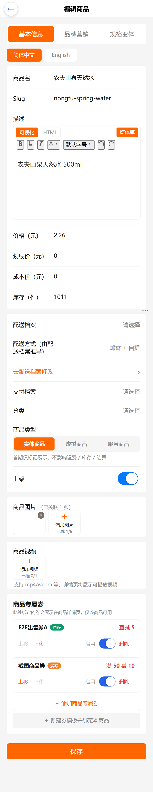

- 选项下方有提示文案：「首期仅标记展示，不影响运费 / 库存 / 结算」——即本期该字段只做分类标记，改了不会改变商品的运费、库存与结算行为

### 7.2 默认值与存量商品

- 新商品默认选中 **实体商品**
- **存量老商品**（未设置过类型）打开编辑表单时回退显示「实体商品」；此时点保存，该商品会落为 `physical`
- 已明确选择过类型的商品，重开表单回显其所设类型

### 7.3 防覆盖说明

- 商品类型随商品表单整体保存，**只修改价格、库存等其他字段再保存时，已设置的商品类型不会被清空**——正常编辑保存不会丢失该标记

---

## 8. 酒店房量日历（2026-10-10）

> 范围：web-admin 商品编辑「规格变体」Tab 新增 **房量日历**（仅酒店房型变体显示）。按日管理总房量 / 关房，支持单日编辑与批量设置；C 端余量展示（任务 5）复用同一数据源。

### 8.1 入口与前提

1. 进入 **商品管理 → 编辑商品**，切换到 **「规格变体」** Tab
2. 页面下半部分出现 **「酒店房型配置」** 卡片（仅变体已配置 `hotelRoomConfig` 时显示配置态；未配置时先选模板套用）
3. 点击 **「展开房量日历」**

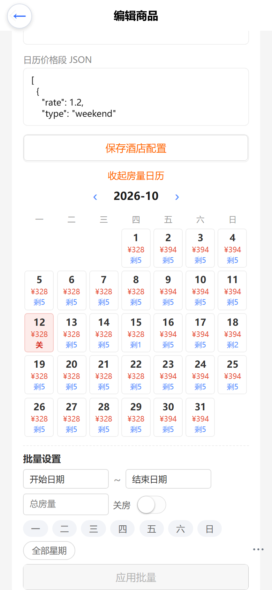

### 8.2 月视图网格

- 每格显示 **日号 / 当晚价 / 房态** 三行：价格为逐晚计价结果（周内价 × 周末/节假日系数，如 ¥328 / ¥394）
- 房态文案：**剩N**（剩余 N 间）、**满**（剩余 0 间）、**关**（当日关房，红底标记）
- 顶部 ‹ › 切换上/下月，自动重新加载

### 8.3 单日编辑

- 点击任意日期格弹出编辑层：**总房量** 输入 + **关房** 开关 + 保存本日
- 仅保存传入字段：只改关房不动房量、或只改房量不动关房均可

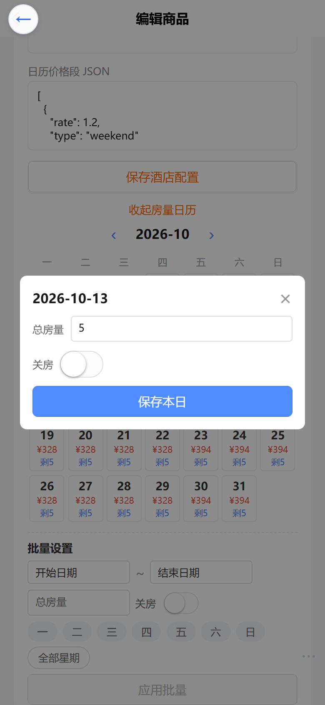

### 8.4 批量设置

- 选择 **开始日期 ~ 结束日期**（含两端）+ 总房量 + 关房开关
- **按星期过滤**：点选周一~周日多选 chip 后仅应用到命中星期；不选 = 全部日期
- 「全部星期」一键清空过滤；「应用批量」按所选范围落库

### 8.5 口径说明

- 无显式房量行的日期回退变体 `hotelRoomConfig.totalRooms`；两者都缺 = **不限房**
- 剩余 = 总房量 − 占用（未过期锁 + 已订），关房当日恒为满房不可订
- 数据源与 C 端 `hotelAvailability` 同一服务（`getAvailabilityDetailed`），后台所见即 C 端可订口径

---

## 9. 酒店房态余量展示（2026-10-10）

> 范围：nshop C 端酒店详情页 **日期选择条（DateBar）** 实时展示所选入住区间的房态余量，并在满房时前端直接拦截下单动作。与第 8 节后台房量日历同一数据源（`hotelAvailability` shop API）。

### 9.1 三态展示

选择入住/离店日期后，日期条下方按区间内**最紧的一晚**显示房态提示：

| 区间房态 | 展示 | 样式 |
| --- | --- | --- |
| 有某一晚关房/满房 | `{date} 已满房，请调整入住日期` | 红色 |
| 最紧一晚剩余 ≤ 2 间 | `仅剩 {n} 间，建议尽快预订` | 橙色 |
| 余量充足 | `所选日期余 {n} 间` | 灰色 |

红色满房态（默认区间含 10-12 关房晚）：

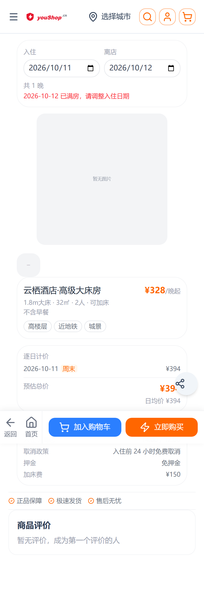

灰色余量态（10-13 → 10-14，余 5 间）：

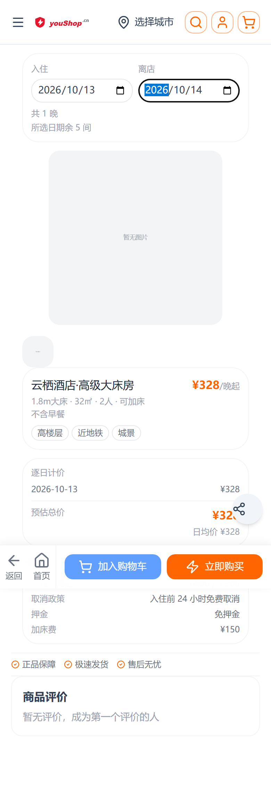

橙色紧张态（10-13 → 10-15，仅剩 1 间）：

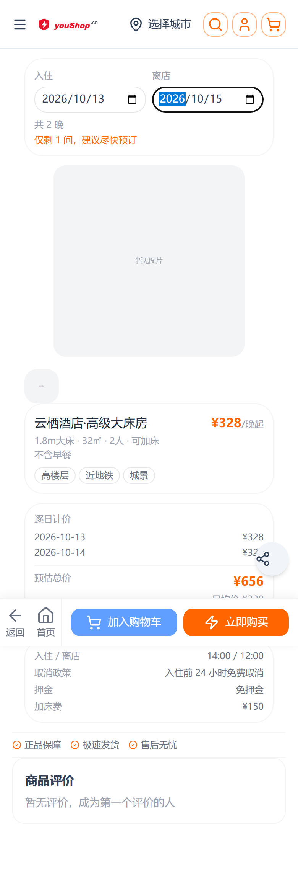

### 9.2 满房拦截

所选区间含满房/关房晚时，点击 **加入购物车 / 立即购买** 会被前端直接拦截并弹出 toast，请求不发出：

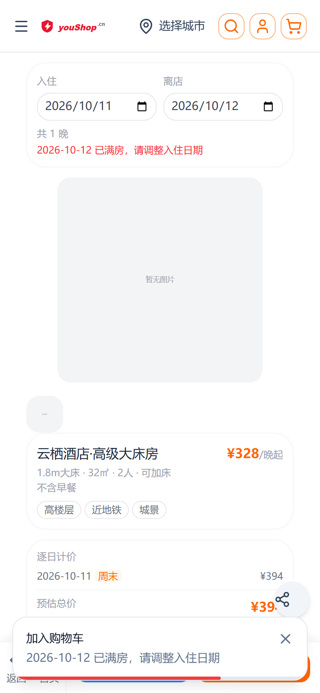

### 9.3 口径与兜底说明

- **含头不含尾**：`hotelAvailability` 返回 `checkIn` 起至 `checkOut` 前一晚的逐晚数据（离店当晚不计）；区间最紧一晚决定提示档位
- **不限房**：某晚 `remaining = null` 表示不限房，不参与「最紧」比较；`closed = true` 当晚按 0 间计
- **双保险**：前端拦截只是体验层；并发超卖由服务端 `OrderInterceptor` 最终校验——即便前端提示过期，下单时后端仍会返回 `HOTEL_SOLD_OUT: <date>`，C 端解析后转成同样的「{date} 已满房」toast（i18n 词条 `messages.hotel.roomsSoldOut`）
- 文案已覆盖全部 12 语言包（zh-CN / en-US / ru-RU / pt-BR / ko-KR / ja-JP / it-IT / fr-FR / fa-IR / es-ES / bg-BG / de-DE）

---

## 10. 房价方案选择（2026-10-10）

> 范围：nshop C 端酒店详情页在逐日计价上方新增 **房价方案 chips**（`ProductDetailRatePlanChips`），选中方案后逐日计价即时按方案重算；下单时订单行携带 `ratePlanCode`，由后端计价策略按同一方案口径出价。方案数据来自 P2 房价方案（`hotelRatePlans` shop API）。

### 10.1 方案 chips

- 首个 chip 固定为 **标准价**（清空选择，回退基线价）；其后为该房型启用的方案，按后台创建顺序排列
- chip 文案 = 角标 + 名称 + 预估价：`特惠 早鸟9折 ¥295/晚`、`协议价 协议价 ¥258/晚`；预估价为后端 `avgNightlyEstimateCent`（按基价折算的每晚安估价，非精确总价）
- 角标按类型自动标注：discount → `特惠`、fixed → `协议价`、surcharge → `节假日`、memberOnly → `会员`（另加成员专属描边样式）
- **会员方案 fail-closed**：`memberOnly` 方案仅对会员等级达标的登录顾客可见——匿名请求不返回（下图匿名态只有 3 个 chip，VIP3 会员价不可见），接口异常时静默降级为不展示 chips

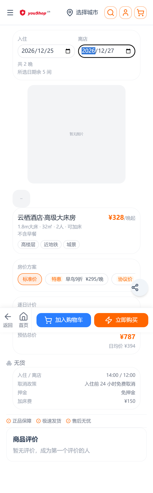

### 10.2 选中方案联动重算

选中方案后，「逐日计价」标题旁显示方案名角标，逐晚价、预估总价、日均价全部按方案口径重算（与后端订单行计价同一语义）：

| 方案 | 逐晚口径 | 连住优惠 | 示例（¥328 基价 × 周末 1.2 × 2 晚） |
| --- | --- | --- | --- |
| 标准价（基线） | 日类型段价 | 叠加 | ¥394/晚，总价 ¥787 |
| 早鸟9折（discount 900） | 段价 ×0.9 | 继续叠加 | ¥354/晚，总价 ¥708 |
| 协议价（fixed 25800） | 固定 ¥258/晚 | **不叠加** | ¥258/晚，总价 ¥516 |
| 节假日（surcharge） | 段价 + 加价额 | 继续叠加 | 逐晚 +加价额 |

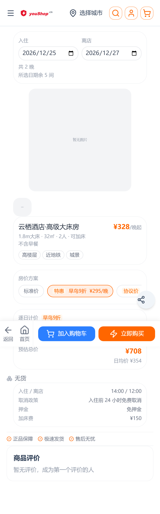

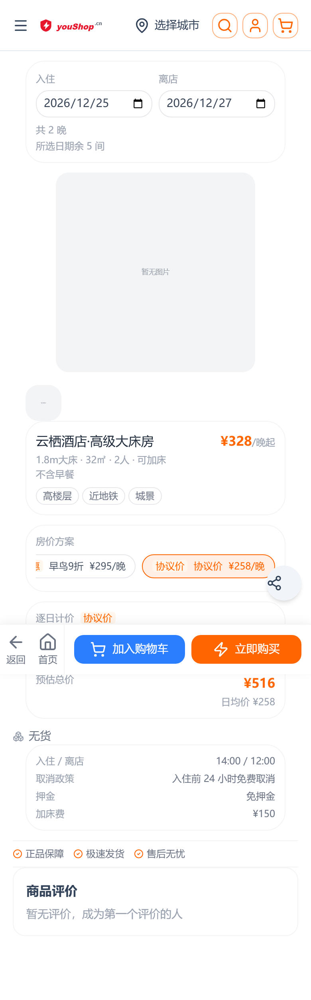

### 10.3 口径与兜底说明

- **同源计价**：前端 `calcNightPrices(cfg, in, out, ratePlan)` 与后端 `rate-plan-logic.applyNightlyAdjustment` 同一语义（discount 千分比 / fixed 固定 / surcharge 加价；fixed 不叠连住折扣），前后端展示与订单行价格一致；订单行按 **含税挂牌价** 口径出价（`priceIncludesTax: true`），不再被渠道默认税率放大
- **下单携带**：加入购物车 / 立即购买的订单行 `customFields.ratePlanCode` 记录所选方案（未选方案不带）；后端按 code + 入住日 + 会员等级校验可售后重算价格，方案失效自动回退基价
- **失效自愈**：方案列表刷新后，已选方案若失效（停用/不可见/不在返回中）自动清空选择回标准价
- **版式开关**：chips 区块受详情页版式配置 `blocks.ratePlans` 控制（默认开启），classic/floor/dualBuy 三版式共用同一组件
- 文案已覆盖全部 12 语言包（zh-CN / en-US / ru-RU / pt-BR / ko-KR / ja-JP / it-IT / fr-FR / fa-IR / es-ES / bg-BG / de-DE）

---

> **文档版本**：v1.0 ｜ **适用系统**：nshop（Nuxt 3）+ vendure + web-admin（uni-app）
> **更新日期**：2026-09-13 ｜ **截图**：手机视口 390×844 dpr=2
