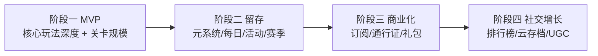

# 消消乐项目对标主流产品的差距评估与落地路线图

> 评估基准：开心消消乐（国内国民级）+ Candy Crush（全球标杆）综合共性
> 方法：代码事实核实（四个维度各由 code-explorer 子代理逐项取证）+ 主流特性对标 + 可扩展性判定
> 结论性质：仅规划，不实现；落地依据见各维度「证据」列（均为 `文件:行号`）

---

## 0. 项目现状总览（已核实）

- **规模**：`src` 下 49 个 TS 文件，分层清晰（`core / modes / scenes / ui / config / api`）。
- **玩法模式**：三消 `Match3Scene` + 创新模式 `PoetryMatchScene`（诗词配对）+ `AudioMatchScene`（听音辨位）。
- **关卡总量**：`ALL_LEVELS` 共 **48 关**（三消 20 + 听音 14 + 诗词 14），见 `LevelConfig.ts:920-931`。
- **引擎成熟度**：级联消除 + 连击倍率（2 串 1.5x / 3 串起 2x）、4 类特效棋、4 类特效组合、3 类障碍、collect/score 目标、提示/重排/锤子、失败广告救援——核心闭环已可玩。
- **元系统骨架**：SSO 登录、皮肤分享码 + 云端市场（`SkinApi` 已接通 HTTP）、商城（实体/礼包/皮肤/促销）、广告（2 类）、积分双货币、家长时长守护、埋点（`SessionTracker`/`AdaptiveEngine`）、新手引导。
- **差异化优势（相对主流的独有卖点，路线图应保留并放大）**：诗词 + 听音双创新模式、双阳绿金主题皮肤、UGC 皮肤创作/分享码、适老化（长辈日常养护文案）。

---

## 1. 四维差距矩阵

优先级说明：**P0** = 体验基线/规模短板，应先补齐；**P1** = 主流标配、低成本可接入，提升留存/商业化；**P2** = 需后端/大改，长期投入。

### 维度一：核心玩法 / 关卡

| 能力 | 主流标配 | 本项目现状（证据） | 缺口 | 优先级 |
|---|---|---|---|---|
| 障碍种类 | 果冻层、巧克力蔓延、锁链、双层冰、传送门、传送带 | 引擎实现 `frozen`/`chained`/`blackhole` 3 种，同源（不可移动+相邻解锁，无双层）`Match3Engine:33,162-175,205-208`；配置声明 5 种但 `radical` 死类型、`interference` 仅听音关用 | 果冻层、巧克力蔓延、传送门、双层障碍 | P1 |
| 特效组合 | 火箭+火箭、包裹+包裹、包裹+火箭、同色炸弹+任意、colorBomb+火箭/包裹、鱼 | 已支持 rocket+rocket / wrap+wrap / wrap+rocket / colorBomb+任意（简化）`Match3Engine:611-630`；缺 colorBomb+rocket/wrap 签名行为、`fish` 完全缺失 | colorBomb+rocket/wrap、鱼 | P2 |
| 关卡目标 | 收集、分数、掉落原料、订单、Boss 血量、限时 | 仅 `collect` + `score` `Match3Engine:251-260` | 掉落收集、Boss 血量、限时关 | P1 |
| 关卡规模 / 章节地图 | 数百关 + 章节世界地图（节点/路径/剧情） | 48 关；有 `chapter`/`theme` 字段但 `chapter` 未被 UI 使用；选关为 mode 平铺卡片网格（自称"地图"但非节点）`LevelSelectScene:178-194` | 关卡总量偏低、章节地图化 | P0 |
| 星星评分 | 1–3 星 + 解锁进度 | 已实现（阈值算法：超额≥50%&省步≥40%→3★）`ProgressStore:51-65`、`LevelSelectScene:254` | 已具备（可保留） | — |
| 手感 / juice | 大招华丽演出、拖尾、confetti、背景微动 | 粒子/冲击环/飘字/连击演出/过关三星弹出/程序化音效 均已有 `Feedback.ts`、`Match3Scene:387-401` | 大招演出层级、拖尾、confetti、背景微动 | P2 |

### 维度二：元系统 / 留存

| 能力 | 主流标配 | 本项目现状（证据） | 缺口 | 优先级 |
|---|---|---|---|---|
| 章节世界地图 | 路径/节点/剧情演出 | 卡片网格列表；`chapter` 字段存在但 UI 未用；仅 theme 季节标签 `LevelSelectScene:203,294` | 节点式地图 + 剧情节点 | P0/P1 |
| 每日奖励 / 连续签到 | 每日登录 + 连续签到日历 | 仅"每日首次随机道具+1锤+5积分"，按日期去重，无连签/阶梯 `ProgressStore:264-272` | 连续签到 + 日历 | P1 |
| 幸运转盘 | 转盘抽奖 | 无（`wheel`/`spin wheel` 全局无实现） | 转盘 | P1 |
| 限时活动 | 活动框架 + 入口 | 无（仅商城 promo 促销文案 `ShopData:162-165`） | 活动框架 + 入口 | P1/P2 |
| 赛季 / 通行证 | 赛季 + 通行证 | 无 | 赛季通行证 | P1/P2 |
| 成就系统 | 可扩展成就 | 无通用系统；仅 1 个硬编码"双阳纪念徽章"一次性 `ProgressStore:39-47` | 成就框架 | P1 |
| 日常任务 | 任务/quest | 无 | 日常任务 | P1 |
| 推送召回 | 本地/远程推送 | 无（纯前端 localStorage；SafetyManager 仅护眼时长上限） | 召回推送 | P2 |
| 新手引导 | 首进手把手 | 已有 `TutorialOverlay`，三模式各 3 步 `TutorialOverlay:14-30` | 已具备 | — |

### 维度三：商业化

| 能力 | 主流标配 | 本项目现状（证据） | 缺口 | 优先级 |
|---|---|---|---|---|
| 广告（激励视频多场景） | 多场景激励视频 + 插屏 | `rewarded`+`interstitial` 两类；仅 3 处用 `showRewarded`（失败救援+5步、步数告急+3步、商城领道具），`interstitial` 零调用 `AdManager:17,59-60,222-236` | 多场景 + 启用插屏 | P1 |
| 内购礼包档位 | 充值档位 / 礼包 | 7 个道具礼包 `priceCents` 全 0（免费）；无档位 | 充值档位、付费礼包 | P1 |
| 首充 | 首充礼包 | 有 `pack_firstcharge` 商品 + 入场弹窗，但**无"是否首充过"判定**（每次弹）`Match3Scene:228` | 首充逻辑闭环 | P1 |
| 付费去广告 | ad-free | 无 | 付费去广告 | P1 |
| 复活 / 加步 | 看广告/付费续命 | 已有（广告续命/复活包/容错包）`Match3Scene:815-892,979` | 已具备（保留强化） | — |
| 订阅 / 通行证 | 黄金通行证 / 赛季订阅 | 无 | 订阅/通行证 | P2 |
| 储蓄罐 / 神秘宝箱 | piggy bank / mystery box | 无 | 储蓄罐、神秘宝箱 | P2 |
| VIP / 会员权益 | 会员体系 | 无（"会员"仅促销文案） | VIP 体系 | P2 |
| 真支付 | 支付网关 + 验单 | 纯 mock：所有 `vendureUrl` 为占位域 `braingarden.example` → 永远本地发放；客户端无法验单 `Purchase:9,25,40` | 真实支付链路 | P2 |

### 维度四：社交 / 增长

| 能力 | 主流标配 | 本项目现状（证据） | 缺口 | 优先级 |
|---|---|---|---|---|
| 排行榜 | 关卡/好友排行 | 无（`leaderboard`/`rank` 全局 0 命中） | 排行榜 | P2 |
| 好友系统 | 好友比分 / 助战 | 仅"按账号名赠皮肤"单向 `gift` `SkinApi:218-225`；无关系链 | 好友关系链 | P2 |
| 分享裂变 | 邀请 / 分享回流 | 邀请码 + 皮肤分享码 + 结算页分享得道具（3 处）`SsoAuth:102-106`、`ResultScene:175-203` | 邀请奖励闭环、战绩海报 | P1 |
| 跨设备云存档 | 进度同步 | 进度纯本地 `localStorage`(`bg_progress_v1`)；仅积分部分上云 `ProgressStore:43,284-291` | 进度云同步 | P1/P2 |
| UGC 皮肤生态 | 创作/审核/推荐/激励 | 客户端全量接通（`SkinApi` 真实 HTTP：publish/redeem/gift/points + 审核字段）；后端不在本仓库、无推荐位 `SkinApi:126-248` | 运营推荐闭环 | P1 |
| SSO 登录 | 统一登录 | 已实现链路 `SsoAuth:20-99` | 已具备 | — |

---

## 2. 四阶段落地路线图



### 阶段一：MVP（核心玩法深度 + 关卡规模）— 工作量：大
- **目标**：补齐玩法深度与内容量，达到"可长期玩"基线。
- **涉及模块**：`Match3Engine`（obstacle/special/goal 扩展）、`LevelConfig`、`Board`/`Feedback` 渲染、`LevelSelectScene`（地图化）。
- **关键改动点**：
  1. P0 章节世界地图：把 `LevelSelectScene` 卡片平铺改为节点式地图（数据层 `chapter` 已备，主要改表现层 + 解锁连线 + 剧情节点触发）。
  2. P0 扩充关卡量至主流量级（数百关的分章内容生产 + 难度曲线自动化标定）。
  3. P1 障碍扩展：新增果冻层（障碍改 `number[][]` layer 计数，`applyClear` 由"置 false"改"layer--"）、巧克力蔓延（settle 后 propagate 回调）、传送门（drop 管线出口格）。
  4. P1 目标扩展：掉落收集 ingredient、Boss 血量、限时关 `timeLimit`。
  5. P2 juice：大招演出、拖尾、confetti、背景微动。
- **低成本项**：果冻层 / 限时关 / juice 变体（算法级微调）。
- **需重构项**：传送门、Boss 血量、巧克力蔓延、章节地图。

### 阶段二：留存（元系统 / 每日 / 活动 / 赛季）— 工作量：中–大
- **目标**：用日常钩子与活动提升 DAU/留存。
- **涉及模块**：新增 `DailyRewardStore`/`AchievementStore`/`TaskStore`/`EventStore`/`SeasonPassStore` 等 core 模块 + `MainMenuScene`/`LevelSelectScene` 顶部栏接入 + 可能新增 `WheelScene`。
- **关键改动点**：
  1. P1 连续签到日历（`ProgressStore.dailyGift` 加 `signStreak`/`lastSignDate` + 阶梯奖励，主菜单弹窗）。
  2. P1 幸运转盘（独立 `WheelScene` + 概率表，零侵入）。
  3. P1 成就系统（监听 `recordResult` 等已有钩子，把"双阳徽章"改造为首条成就，`ResultScene` 庆祝弹窗可复用）。
  4. P1 日常任务 / 限时活动 / 赛季通行证雏形（独立 store，用现有关卡通过/星数事件驱动）。
  5. P0/P1 章节地图已在本阶段与阶段一协同完成。
- **低成本项**：前四项均为独立新模块，对玩法/选关侵入极小。
- **高成本项**：推送召回（Service Worker/Web Push，受平台授权约束）。

### 阶段三：商业化（订阅 / 通行证 / 礼包）— 工作量：中
- **目标**：把已有 mock 商业化闭环转为可营收。
- **涉及模块**：`Purchase`/`ShopData`/`AdManager` 扩展、`ShopScene`。
- **关键改动点**：
  1. P1 激励视频多场景（启用已就绪的 `interstitial`；结算页、日常任务等新增 rewarded 调用点）。
  2. P1 首充逻辑闭环（`ProgressStore.hasFirstPaid` + 弹窗判定）。
  3. P1 付费去广告（`removeAds` 标志 + `AdManager` 顶部 gate + 复用购买链路）。
  4. P1 礼包充值档位（在 `SHOP_ITEM_PACKS` 加 `priceCents` 条目，无需改框架）。
  5. P2 神秘宝箱 / 储蓄罐（新商品类型 + 开箱随机发放 UI）。
  6. P2 黄金通行证 / 订阅 + 真支付（Vendure/Stripe，需后端订单 + 客户端验单，当前 `Purchase:9` 已注明无验单）。
- **低风险先行**：阶段三前半段全部为前端扩展，可立即见效；真支付/订阅为后端长期项。

### 阶段四：社交增长（排行榜 / 云存档 / UGC）— 工作量：大
- **目标**：构建社交关系与跨端资产，放大裂变。
- **涉及模块**：`LeaderboardService`（新增）、`ProgressStore` 云存档化、`SkinScene` 广场运营、`SsoAuth` 邀请闭环。
- **关键改动点**：
  1. P1 邀请奖励闭环（前端补 `bindInvite`/`inviteReward` 发奖调用，复用 `earnPoints` 写法；分享回流天然复用 `consumeUrlParams` 的 `invite_code`）。
  2. P1 UGC 运营推荐位（`SkinApi` 加 `recommend`/`hot` 排序参数 + UI 标签，前端零改核心）。
  3. P1/P2 跨设备云存档：**仿 `AuthStore`/`SkinApi` 的"本地优先 + 云端适配层 + 永不阻断"模式**，给 `ProgressStore` 加 `syncProgress()/pullProgress()` + `ENV.gameServerEnabled` 守卫（本地先写，登录后异步推 `levels/unlocked/modes/items`，启动拉取覆盖，冲突按"最高分/最后写入"合并）。
  4. P2 排行榜（服务端聚合 + 防作弊 + 列表场景）。
  5. P2 好友系统（关系链后端 + 社交场景）。
- **需后端支撑**：排行榜、好友、真支付、通行证订阅、UGC 后端部署。

---

## 3. 架构可扩展性判定（事实依据）

**低成本（复用现有框架，算法级微调，不破管线）**
- 障碍：障碍由单一 `boolean[][]` 改 `number[][]` 即可支持双层/果冻层；`isObstacleCell/getObstacleAt` 已抽象。
- 特效：`colorBomb+rocket/wrap` 签名行为（把对方颜色格转对应 special）、`fish` 新类型，均在 `Match3Engine` 生成/组合分支内同构扩展。
- 限时关：加 `timeLimit` 字段 + 场景计时器即可。
- 每日连签 / 转盘 / 成就 / 日常任务 / 活动 / 赛季：均为**独立新 store / 新场景**，对玩法与选关侵入极小（入口挂主菜单/选关顶部栏）。
- 商业化前端项（激励视频多场景、首充闭环、去广告、礼包档位）：直接扩展 `AdManager`/`Purchase`/`ShopData`/`ShopScene`。

**需中等重构**
- 章节世界地图：`LevelSelectScene` 从 mode 平铺改为节点地图（数据层 `chapter` 已备，主要表现层重构 + 剧情体系）。
- 传送门 / ingredient 掉落：需在 `dropTiles` 下落管线引入"出口格/横向流动"。
- 巧克力蔓延：需扩展 `applyClear/settle` 事件流，加每步 propagate 回调。
- 多层障碍渲染：`Board` 当前 `paintSpecial` 仅单层，需扩展按 layer 数绘制遮罩。
- Boss 血量：与现有"步数/分数/收集"结算模型正交，需敌方实体/HP 轨道 + 场景大改。

**需较大投入（服务端 / 平台级）**
- 排行榜、好友关系链、真支付/验单、通行证订阅、VIP、UGC 后端运营、跨设备云存档后端、Web Push 召回。
- 云存档前端改造可借鉴 `AuthStore`/`SkinApi` 的"本地优先 + 云端适配层"模式平滑过渡。

**数据完整性提示（改造前必读）**：`LevelConfig` 的 `ObstacleConfig.type` 声明了 `interference`/`radical`/`chain`/`blackhole`/`frozen` 5 种，但 `Match3Engine` 只分发 `frozen`/`chained`/`blackhole` 三种——`radical` 从未被实例化为关卡，`interference` 仅听音关使用且不经本引擎。扩充障碍前建议先统一配置类型与引擎分发分支，避免死类型累积。

---

## 4. 差异化优势保留（不要当作短板补齐，应放大）

- **诗词配对 + 听音辨位双创新模式**：相对主流的独有玩法，应在章节地图、活动、皮肤系统中持续作为招牌内容强化。
- **双阳绿金主题**：已统一三消/诗词/听音三模式视觉，建议沉淀为"地方文化联名"系列（对标开心消消乐 IP 联动打法）。
- **UGC 皮肤创作 + 分享码**：`SkinApi` 客户端已全量接通，是天然的内容生态与增长飞轮，优先把运营闭环（推荐/审核/激励）做扎实。
- **适老化（长辈日常养护）**：商城文案与交互已体现，可作差异化人群定位。

---

## 5. 优先级总表（建议执行序）

| 优先级 | 项 | 阶段 | 成本 |
|---|---|---|---|
| P0 | 章节世界地图化 | 一 | 中–大 |
| P0 | 关卡规模扩充 + 难度自动化 | 一 | 大 |
| P1 | 障碍扩展（果冻/巧克力/传送/双层） | 一 | 低–中 |
| P1 | 目标扩展（掉落/Boss/限时） | 一 | 中 |
| P1 | 连续签到 + 幸运转盘 + 成就 + 日常任务 | 二 | 低–中 |
| P1 | 限时活动 / 赛季通行证雏形 | 二 | 中 |
| P1 | 激励视频多场景 + 首充闭环 + 去广告 + 礼包档位 | 三 | 低–中 |
| P1 | 邀请奖励闭环 + UGC 推荐位 + 云存档前端改造 | 四 | 低–中 |
| P2 | 大招 juice / fish / colorBomb 组合补全 | 一 | 低 |
| P2 | 神秘宝箱 / 储蓄罐 / 真支付 / 订阅 / VIP | 三–四 | 中–大 |
| P2 | 排行榜 / 好友 / 推送召回 | 四 | 大 |
```
